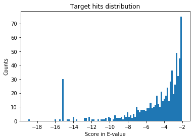
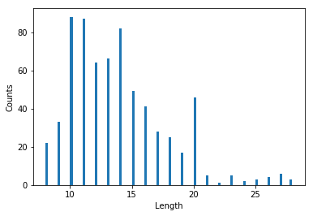

As a continuation to my previous blog on [Proteomics with OMSSA](https://sivome.github.io/proteomics/2019/03/02/Proteomics-with-OMSSA.html), here I extend the analyses to look at a open-access yeast data set. Few open-source efforts to get the mass-spectrometry based proteomics efforts are [PeptideAtlas](http://www.peptideatlas.org/), [MassIVE](https://massive.ucsd.edu/ProteoSAFe/static/massive.jsp), [PRIDE](https://www.ebi.ac.uk/pride/archive/), [Proteome Exchange Consortium](http://www.proteomexchange.org/). I used Proteome Exchange Consortium to get this dataset. The original format of the dataset was RAW. I converted this complex version to a much simpler MGF version for the current blog.


Let's take a look at the actual data from the mass-spec. As I mentioned earlier, the current dataset used is MGF version i.e., mascot generic version. This is how a sample MGF file looks like:

```console
C:\Users\Viswa\folder_for_analyses>head -n 20 Yeast.mgf
BEGIN IONS
TITLE=index=0
PEPMASS=519.7517
CHARGE=2+
SCANS=16
RTINSECONDS=1.878
149.12 30.216585
149.985 29.74796
175.185 20.990004
177.198 17.410294
201.096 16.743763
230.869 28.351389
243.217 27.75121
255.166 10.026513
272.247 34.915855
273.127 19.958282
281.883 17.084764
290.254 20.235743
294.149 14.525609
300.068 33.84702
```
As you can see, the peptide mass [PEPMASS], charge state [CHARGE], scan number, retention time and the peak lists are present in this format. OMSSA uses the PEPMASS*CHARGE as possible observed peptide mass, and then looks for the peptide that matches this mass. In this case, the enzyme used to digest the protein is trypsin. Since trypsin cleaves at K/R, the program digests the protein sequence (both for targets and decoys), and if the in-silico peptide from the digest matches the PEPMASS*CHARGE from MGF file, it scores the peptide. In OMSSA, you can think of this score as E-value (similar to BLAST scoring). It does this for all the scans in the mgf file and scores all the possible peptide matches. This can be understood easily from the analyses below.


We also need a fasta file to run the database serach. We call it a database search, if we know that there is an available protein sequence. Since this is Yeast data, we need Yeast fasta file and this is one of the species that has multiple fasta file. You should obviously pick the strain that is closer to what your sample represents.

There are multiple places to get this fasta and in the previous blogs, I mentioned about the NCBI resources. This time, let's focus on a different repository called [UniProt](https://www.uniprot.org/). This is a resource, as the name says, provides information on proteins that is comprehensive, well annotated. There are different versions of the database depending on the kinds of analyses you're doing. Here, I used [Baker's yeast](https://www.uniprot.org/taxonomy/559292). There are few options of which variant of the database you can pick in UniProt. One such variant is SwissProt that has reviewed protein sequences. Here is how the fasta file looks like:

```console
C:\Users\Viswa\blastDb>head -n 20 S288c.fasta
>sp|P32768|FLO1_YEAST Flocculation protein FLO1 OS=Saccharomyces cerevisiae (strain ATCC 204508 / S288c) OX=559292 GN=FLO1 PE=1 SV=4
MTMPHRYMFLAVFTLLALTSVASGATEACLPAGQRKSGMNINFYQYSLKDSSTYSNAAYM
AYGYASKTKLGSVGGQTDISIDYNIPCVSSSGTFPCPQEDSYGNWGCKGMGACSNSQGIA
YWSTDLFGFYTTPTNVTLEMTGYFLPPQTGSYTFKFATVDDSAILSVGGATAFNCCAQQQ
PPITSTNFTIDGIKPWGGSLPPNIEGTVYMYAGYYYPMKVVYSNAVSWGTLPISVTLPDG
TTVSDDFEGYVYSFDDDLSQSNCTVPDPSNYAVSTTTTTTEPWTGTFTSTSTEMTTVTGT
NGVPTDETVIVIRTPTTASTIITTTEPWNSTFTSTSTELTTVTGTNGVRTDETIIVIRTP
TTATTAITTTEPWNSTFTSTSTELTTVTGTNGLPTDETIIVIRTPTTATTAMTTTQPWND
TFTSTSTELTTVTGTNGLPTDETIIVIRTPTTATTAMTTTQPWNDTFTSTSTELTTVTGT
NGLPTDETIIVIRTPTTATTAMTTTQPWNDTFTSTSTEITTVTGTNGLPTDETIIVIRTP
TTATTAMTTPQPWNDTFTSTSTEMTTVTGTNGLPTDETIIVIRTPTTATTAITTTEPWNS
TFTSTSTEMTTVTGTNGLPTDETIIVIRTPTTATTAITTTQPWNDTFTSTSTEMTTVTGT
NGLPTDETIIVIRTPTTATTAMTTTQPWNDTFTSTSTEITTVTGTTGLPTDETIIVIRTP
TTATTAMTTTQPWNDTFTSTSTEMTTVTGTNGVPTDETVIVIRTPTSEGLISTTTEPWTG
TFTSTSTEMTTVTGTNGQPTDETVIVIRTPTSEGLVTTTTEPWTGTFTSTSTEMTTITGT
NGVPTDETVIVIRTPTSEGLISTTTEPWTGTFTSTSTEMTTITGTNGQPTDETVIVIRTP
TSEGLISTTTEPWTGTFTSTSTEMTHVTGTNGVPTDETVIVIRTPTSEGLISTTTEPWTG
TFTSTSTEVTTITGTNGQPTDETVIVIRTPTSEGLISTTTEPWTGTFTSTSTEMTTVTGT
NGQPTDETVIVIRTPTSEGLVTTTTEPWTGTFTSTSTEMSTVTGTNGLPTDETVIVVKTP
TTAISSSLSSSSSGQITSSITSSRPIITPFYPSNGTSVISSSVISSSVTSSLFTSSPVIS

C:\Users\Viswa\blastDb>
```

You can download the fasta file [here](https://www.uniprot.org/uniprot/?query=S288c+AND+reviewed%3Ayes&sort=score).
if you read the [earlier blog](https://sivome.github.io/proteomics/2019/03/02/Proteomics-with-OMSSA.html), it is easy to figure out how to use the fasta file for proteomics search with OMSSA. There is something called target-decoy database that is recommended to use for proteomics search. As the name says, we need to append a decoy version of the fasta file to the original fasta file to create this target-decoy database. OMSSA then scores the peaks in the mgf file to the peptides obtained from the protein sequences from target+decoy version. OMSSA or other similar database search program then uses the metrics from decoy hits properly choosing the _true hits_. More information on the target-decoy database search [here](https://www.ncbi.nlm.nih.gov/pmc/articles/PMC2922680/).

[There is a open-source perl script](https://edwardslab.bmcb.georgetown.edu/mascot/help/decoy_help.html) available that does this job of appending decoy version of the fasta file to the target fasta file. The decoy version, in the current blog, will have ###REV### appended to the protein name. You can do a simple string match to this _###REV###_ to identify and filter out these hits, post-OMSSA search. Here, I will not use a stringent FDR approach, but use a simple filter based on decoy hits, i.e., cut-off of E-value (BLAST-like score used in OMSSA searches).

I already talked about how to run an OMSSA search in my earlier blog, and there is a [github repo](https://github.com/viswam78/searchOMSSA) to set up the OMSSA searches. Here, I want to focus on how to best report the actual proteomics search results.


```python
import numpy as np
import pandas as pd
import matplotlib.pyplot as plt
from matplotlib import ticker
```


```python
# Display multiple columns, common in high-dimensional space (add rows as well)
pd.set_option('display.max_columns', 100)
pd.set_option('display.max_rows', 20)
```
Here, we read the OMSSA output into a pandas data frame.

```python
omssa_output = pd.read_csv("S288c_run.csv")
```


```python
omssa_output.head() # Talk about different accessions?
```


<div>
<style scoped>
    .dataframe tbody tr th:only-of-type {
        vertical-align: middle;
    }

    .dataframe tbody tr th {
        vertical-align: top;
    }

    .dataframe thead th {
        text-align: right;
    }
</style>
<table border="1" class="dataframe">
  <thead>
    <tr style="text-align: right;">
      <th></th>
      <th>Spectrum number</th>
      <th>Filename/id</th>
      <th>Peptide</th>
      <th>E-value</th>
      <th>Mass</th>
      <th>gi</th>
      <th>Accession</th>
      <th>Start</th>
      <th>Stop</th>
      <th>Defline</th>
      <th>Mods</th>
      <th>Charge</th>
      <th>Theo Mass</th>
      <th>P-value</th>
      <th>NIST score</th>
    </tr>
  </thead>
  <tbody>
    <tr>
      <th>0</th>
      <td>120</td>
      <td>index=120</td>
      <td>GSIDEQHPR</td>
      <td>0.099394</td>
      <td>1037.487</td>
      <td>0</td>
      <td>BL_ORD_ID:50</td>
      <td>250</td>
      <td>258</td>
      <td>sp|P06169|PDC1_YEAST Pyruvate decarboxylase is...</td>
      <td>NaN</td>
      <td>2</td>
      <td>1037.490</td>
      <td>3.803824e-05</td>
      <td>0</td>
    </tr>
    <tr>
      <th>1</th>
      <td>120</td>
      <td>index=120</td>
      <td>GSIDEQHPR</td>
      <td>0.099394</td>
      <td>1037.487</td>
      <td>0</td>
      <td>BL_ORD_ID:131</td>
      <td>250</td>
      <td>258</td>
      <td>sp|P26263|PDC6_YEAST Pyruvate decarboxylase is...</td>
      <td>NaN</td>
      <td>2</td>
      <td>1037.490</td>
      <td>3.803824e-05</td>
      <td>0</td>
    </tr>
    <tr>
      <th>2</th>
      <td>339</td>
      <td>index=339</td>
      <td>TSGRPIKGDSSAGGK</td>
      <td>0.001174</td>
      <td>1416.728</td>
      <td>0</td>
      <td>BL_ORD_ID:2647</td>
      <td>176</td>
      <td>190</td>
      <td>sp|P47075|VTC4_YEAST Vacuolar transporter chap...</td>
      <td>NaN</td>
      <td>3</td>
      <td>1416.731</td>
      <td>5.359808e-07</td>
      <td>0</td>
    </tr>
    <tr>
      <th>3</th>
      <td>421</td>
      <td>index=421</td>
      <td>TSGRPIKGDSSAGGK</td>
      <td>0.035522</td>
      <td>1416.729</td>
      <td>0</td>
      <td>BL_ORD_ID:2647</td>
      <td>176</td>
      <td>190</td>
      <td>sp|P47075|VTC4_YEAST Vacuolar transporter chap...</td>
      <td>NaN</td>
      <td>2</td>
      <td>1416.731</td>
      <td>1.624232e-05</td>
      <td>0</td>
    </tr>
    <tr>
      <th>4</th>
      <td>506</td>
      <td>index=506</td>
      <td>NEETSGEGGEDKNEPSSK</td>
      <td>0.028961</td>
      <td>1892.786</td>
      <td>0</td>
      <td>BL_ORD_ID:4527</td>
      <td>76</td>
      <td>93</td>
      <td>sp|Q02776|TIM50_YEAST Mitochondrial import inn...</td>
      <td>NaN</td>
      <td>3</td>
      <td>1892.789</td>
      <td>1.991815e-05</td>
      <td>0</td>
    </tr>
  </tbody>
</table>
</div>


```python
omssa_output.columns
```


    Index(['Spectrum number', ' Filename/id', ' Peptide', ' E-value', ' Mass',
           ' gi', ' Accession', ' Start', ' Stop', ' Defline', ' Mods', ' Charge',
           ' Theo Mass', ' P-value', ' NIST score'],
          dtype='object')


Let's take a look at the E-value distribution. This is central to understanding output of OMSSA. We have to consider the hits that are meaningful.
Let's plot all the hits.
```python
eps=1e-32 # To take care of zeoes
fig, ax = plt.subplots()
plt.hist(np.log10(eps + omssa_output[' E-value']), bins = 100)
loc = ticker.MultipleLocator(base=2) # thanks again to google!
ax.xaxis.set_major_locator(loc)
ax.set_xlabel('Score in E-value')
ax.set_ylabel('Counts')
ax.set_title('Score distribution')
fig.tight_layout
```


    <bound method Figure.tight_layout of <Figure size 432x288 with 1 Axes>>


The lower the E-value the better. Since we applied log10 transformation, a value of -5 on the x-axis represents 1e-5. Left hits have a high probability of being correct than if you go right.

In the dataset, we also included oxidation as a variable modification. What this means is that the program looks for +16Da on Met to make a call of the peptide being Met Oxidized or not. We can create a new column called "IsMod" that tells us if there is oxidiaton or not. If the IsMod is True, then there is oxidation on the peptide.

```python
# Add IsMod column to see where oxidation is
omssa_output[' IsMod'] = omssa_output[' Mods'].str.match('oxidation', na=False)
```
Let's print out the modified peptide spectral matches here.

```python
mods_only = omssa_output[omssa_output[' IsMod'].values]
mods_only.head()
```


<div>
<style scoped>
    .dataframe tbody tr th:only-of-type {
        vertical-align: middle;
    }

    .dataframe tbody tr th {
        vertical-align: top;
    }

    .dataframe thead th {
        text-align: right;
    }
</style>
<table border="1" class="dataframe">
  <thead>
    <tr style="text-align: right;">
      <th></th>
      <th>Spectrum number</th>
      <th>Filename/id</th>
      <th>Peptide</th>
      <th>E-value</th>
      <th>Mass</th>
      <th>gi</th>
      <th>Accession</th>
      <th>Start</th>
      <th>Stop</th>
      <th>Defline</th>
      <th>Mods</th>
      <th>Charge</th>
      <th>Theo Mass</th>
      <th>P-value</th>
      <th>NIST score</th>
      <th>IsMod</th>
    </tr>
  </thead>
  <tbody>
    <tr>
      <th>55</th>
      <td>729</td>
      <td>index=729</td>
      <td>SKQEASQmAAmAEK</td>
      <td>0.003606</td>
      <td>1540.685</td>
      <td>0</td>
      <td>BL_ORD_ID:6013</td>
      <td>655</td>
      <td>668</td>
      <td>sp|P32589|HSP7F_YEAST Heat shock protein homol...</td>
      <td>oxidation of M:8 ,oxidation of M:11</td>
      <td>2</td>
      <td>1540.687</td>
      <td>0.000002</td>
      <td>0</td>
      <td>True</td>
    </tr>
    <tr>
      <th>91</th>
      <td>1001</td>
      <td>index=1001</td>
      <td>YATmTGHHVER</td>
      <td>0.023147</td>
      <td>1316.591</td>
      <td>0</td>
      <td>BL_ORD_ID:4636</td>
      <td>70</td>
      <td>80</td>
      <td>sp|P09436|SYIC_YEAST Isoleucine--tRNA ligase, ...</td>
      <td>oxidation of M:4</td>
      <td>3</td>
      <td>1316.593</td>
      <td>0.000011</td>
      <td>0</td>
      <td>True</td>
    </tr>
    <tr>
      <th>92</th>
      <td>1005</td>
      <td>index=1005</td>
      <td>YATmTGHHVER</td>
      <td>0.006636</td>
      <td>1316.593</td>
      <td>0</td>
      <td>BL_ORD_ID:4636</td>
      <td>70</td>
      <td>80</td>
      <td>sp|P09436|SYIC_YEAST Isoleucine--tRNA ligase, ...</td>
      <td>oxidation of M:4</td>
      <td>2</td>
      <td>1316.593</td>
      <td>0.000003</td>
      <td>0</td>
      <td>True</td>
    </tr>
    <tr>
      <th>243</th>
      <td>1754</td>
      <td>index=1754</td>
      <td>TPAEmSRPATTTR</td>
      <td>0.490255</td>
      <td>1433.174</td>
      <td>0</td>
      <td>BL_ORD_ID:3809</td>
      <td>1361</td>
      <td>1373</td>
      <td>sp|P19097|FAS2_YEAST Fatty acid synthase subun...</td>
      <td>oxidation of M:5</td>
      <td>3</td>
      <td>1433.695</td>
      <td>0.000236</td>
      <td>0</td>
      <td>True</td>
    </tr>
    <tr>
      <th>255</th>
      <td>1823</td>
      <td>index=1823</td>
      <td>TPAEmSRPATTTR</td>
      <td>0.517651</td>
      <td>1433.690</td>
      <td>0</td>
      <td>BL_ORD_ID:3809</td>
      <td>1361</td>
      <td>1373</td>
      <td>sp|P19097|FAS2_YEAST Fatty acid synthase subun...</td>
      <td>oxidation of M:5</td>
      <td>3</td>
      <td>1433.695</td>
      <td>0.000250</td>
      <td>0</td>
      <td>True</td>
    </tr>
  </tbody>
</table>
</div>


Define the length column so that we can plot the distribution of length of peptides later.
```python
# Add a length column that represents the length of the peptide
omssa_output[' Length'] = omssa_output[' Peptide'].apply(len)
```

Define the 'IsReverse' column so that we can remove the hits to the decoy database before looking at the distributions.
```python
# Add a IsReverse column to represent if the hit is from target database or the decoy database
omssa_output[' IsReverse'] = omssa_output[' Defline'].str.match('###REV###')
```


```python
Reverse_yeast_hits_only = omssa_output[omssa_output[' IsReverse'].values]
```

Note the Defline column i.e., ###REV### in the initial part of the string represents that the protein is a reverse protein sequence.
```python
Reverse_yeast_hits_only.head()
```


<div>
<style scoped>
    .dataframe tbody tr th:only-of-type {
        vertical-align: middle;
    }

    .dataframe tbody tr th {
        vertical-align: top;
    }

    .dataframe thead th {
        text-align: right;
    }
</style>
<table border="1" class="dataframe">
  <thead>
    <tr style="text-align: right;">
      <th></th>
      <th>Spectrum number</th>
      <th>Filename/id</th>
      <th>Peptide</th>
      <th>E-value</th>
      <th>Mass</th>
      <th>gi</th>
      <th>Accession</th>
      <th>Start</th>
      <th>Stop</th>
      <th>Defline</th>
      <th>Mods</th>
      <th>Charge</th>
      <th>Theo Mass</th>
      <th>P-value</th>
      <th>NIST score</th>
      <th>IsMod</th>
      <th>Length</th>
      <th>IsReverse</th>
    </tr>
  </thead>
  <tbody>
    <tr>
      <th>75</th>
      <td>872</td>
      <td>index=872</td>
      <td>QETASNKPLKLYSCITR</td>
      <td>0.456971</td>
      <td>2007.920</td>
      <td>0</td>
      <td>BL_ORD_ID:9855</td>
      <td>835</td>
      <td>851</td>
      <td>###REV###sp|Q08387|DNLI4_YEAST Reverse sequenc...</td>
      <td>NaN</td>
      <td>3</td>
      <td>2008.042</td>
      <td>0.000310</td>
      <td>0</td>
      <td>False</td>
      <td>17</td>
      <td>True</td>
    </tr>
    <tr>
      <th>117</th>
      <td>1103</td>
      <td>index=1103</td>
      <td>RTLEPTSLGGLIEVLR</td>
      <td>0.574082</td>
      <td>1753.787</td>
      <td>0</td>
      <td>BL_ORD_ID:11219</td>
      <td>659</td>
      <td>674</td>
      <td>###REV###sp|P38850|RT107_YEAST Reverse sequenc...</td>
      <td>NaN</td>
      <td>3</td>
      <td>1753.010</td>
      <td>0.000363</td>
      <td>0</td>
      <td>False</td>
      <td>16</td>
      <td>True</td>
    </tr>
    <tr>
      <th>131</th>
      <td>1179</td>
      <td>index=1179</td>
      <td>KASLLILDDHSDDNK</td>
      <td>0.381089</td>
      <td>1682.339</td>
      <td>0</td>
      <td>BL_ORD_ID:10482</td>
      <td>630</td>
      <td>644</td>
      <td>###REV###sp|Q06673|ECM30_YEAST Reverse sequenc...</td>
      <td>NaN</td>
      <td>3</td>
      <td>1682.848</td>
      <td>0.000249</td>
      <td>0</td>
      <td>False</td>
      <td>15</td>
      <td>True</td>
    </tr>
    <tr>
      <th>167</th>
      <td>1375</td>
      <td>index=1375</td>
      <td>KASLLILDDHSDDNK</td>
      <td>0.378321</td>
      <td>1683.785</td>
      <td>0</td>
      <td>BL_ORD_ID:10482</td>
      <td>630</td>
      <td>644</td>
      <td>###REV###sp|Q06673|ECM30_YEAST Reverse sequenc...</td>
      <td>NaN</td>
      <td>3</td>
      <td>1682.848</td>
      <td>0.000248</td>
      <td>0</td>
      <td>False</td>
      <td>15</td>
      <td>True</td>
    </tr>
    <tr>
      <th>595</th>
      <td>3081</td>
      <td>index=3081</td>
      <td>DAAQVAEEVDDER</td>
      <td>0.733552</td>
      <td>1443.671</td>
      <td>0</td>
      <td>BL_ORD_ID:11559</td>
      <td>428</td>
      <td>440</td>
      <td>###REV###sp|P46367|ALDH4_YEAST Reverse sequenc...</td>
      <td>NaN</td>
      <td>3</td>
      <td>1445.628</td>
      <td>0.000367</td>
      <td>0</td>
      <td>False</td>
      <td>13</td>
      <td>True</td>
    </tr>
  </tbody>
</table>
</div>


Since we know the hits with lower E-value are probably correct, we should not expect many reverse hits lower than e-value of 1e-3.

```python
# All reverse hits seem to be in 0 to -2 region, which is expected.
eps=1e-32 # To take care of zeoes
fig, ax = plt.subplots()
plt.hist(np.log10(eps + Reverse_yeast_hits_only[' E-value']))
loc = ticker.MultipleLocator(base=1) # thanks again to google!
ax.xaxis.set_major_locator(loc)
ax.set_xlabel('Score in E-value')
ax.set_ylabel('Counts')
ax.set_title('Reverse hits distribution')
fig.tight_layout
```


    <bound method Figure.tight_layout of <Figure size 432x288 with 1 Axes>>


From the above distribution, it is clear that there are no reverse hits with E-value lower than 1e-2. So, we can safely consider all the hits below E-value of 1e-2 to be genuine.

```python
subset_yeast_hits_only = omssa_output[~omssa_output[' IsReverse'].values] # See the tilde sign
# Here, we skip the step of filtering the target yeast hits within a FDR (usual norm is to use 1% or these days, even lower at 0.5% FDR)
# Instead we use a simple cut-off. Since we know all the reverse hits are less than 1e-2, we use target hits, that are less than e-value of 1e-2
Target_yeast_hits_only = subset_yeast_hits_only[subset_yeast_hits_only[' E-value'] < 0.01]
```

Let's re-plot the hits, focusing only on the "true hits". An easy way to plot true and false hits can also be found [here](https://github.com/viswam78/searchOMSSA). Ideally this filtering should be done using false discovery rate, that I mentioned above.

```python
# All reverse hits seem to be in 0 to -2 region, which is expected.
eps=1e-32 # To take care of zeoes
fig, ax = plt.subplots()
plt.hist(np.log10(eps + Target_yeast_hits_only[' E-value']), bins = 100)
loc = ticker.MultipleLocator(base=2) # thanks again to google!
ax.xaxis.set_major_locator(loc)
ax.set_xlabel('Score in E-value')
ax.set_ylabel('Counts')
ax.set_title('Target hits distribution')
fig.tight_layout
```


    <bound method Figure.tight_layout of <Figure size 432x288 with 1 Axes>>




Here are top few hits of the target list. If you see the same peptide with the same scan, it most likely means it is coming from a different protein that share the same peptide. This is another down-stream analyses problem that needs to be done correctly. I will write about this later.

```python
Target_yeast_hits_only.head()
```


<div>
<style scoped>
    .dataframe tbody tr th:only-of-type {
        vertical-align: middle;
    }

    .dataframe tbody tr th {
        vertical-align: top;
    }

    .dataframe thead th {
        text-align: right;
    }
</style>
<table border="1" class="dataframe">
  <thead>
    <tr style="text-align: right;">
      <th></th>
      <th>Spectrum number</th>
      <th>Filename/id</th>
      <th>Peptide</th>
      <th>E-value</th>
      <th>Mass</th>
      <th>gi</th>
      <th>Accession</th>
      <th>Start</th>
      <th>Stop</th>
      <th>Defline</th>
      <th>Mods</th>
      <th>Charge</th>
      <th>Theo Mass</th>
      <th>P-value</th>
      <th>NIST score</th>
      <th>IsMod</th>
      <th>Length</th>
      <th>IsReverse</th>
    </tr>
  </thead>
  <tbody>
    <tr>
      <th>2</th>
      <td>339</td>
      <td>index=339</td>
      <td>TSGRPIKGDSSAGGK</td>
      <td>1.173798e-03</td>
      <td>1416.728</td>
      <td>0</td>
      <td>BL_ORD_ID:2647</td>
      <td>176</td>
      <td>190</td>
      <td>sp|P47075|VTC4_YEAST Vacuolar transporter chap...</td>
      <td>NaN</td>
      <td>3</td>
      <td>1416.731</td>
      <td>5.359808e-07</td>
      <td>0</td>
      <td>False</td>
      <td>15</td>
      <td>False</td>
    </tr>
    <tr>
      <th>30</th>
      <td>549</td>
      <td>index=549</td>
      <td>SRGESDDSLNR</td>
      <td>1.937602e-03</td>
      <td>1234.551</td>
      <td>0</td>
      <td>BL_ORD_ID:877</td>
      <td>61</td>
      <td>71</td>
      <td>sp|Q3E754|RS21B_YEAST 40S ribosomal protein S2...</td>
      <td>NaN</td>
      <td>2</td>
      <td>1234.554</td>
      <td>8.562092e-07</td>
      <td>0</td>
      <td>False</td>
      <td>11</td>
      <td>False</td>
    </tr>
    <tr>
      <th>31</th>
      <td>549</td>
      <td>index=549</td>
      <td>SRGESDDSLNR</td>
      <td>1.937602e-03</td>
      <td>1234.551</td>
      <td>0</td>
      <td>BL_ORD_ID:900</td>
      <td>61</td>
      <td>71</td>
      <td>sp|P0C0V8|RS21A_YEAST 40S ribosomal protein S2...</td>
      <td>NaN</td>
      <td>2</td>
      <td>1234.554</td>
      <td>8.562092e-07</td>
      <td>0</td>
      <td>False</td>
      <td>11</td>
      <td>False</td>
    </tr>
    <tr>
      <th>33</th>
      <td>583</td>
      <td>index=583</td>
      <td>ANSDCNDKTDCNANNDCSNESDCNAK</td>
      <td>9.257848e-04</td>
      <td>2992.052</td>
      <td>0</td>
      <td>BL_ORD_ID:3714</td>
      <td>581</td>
      <td>606</td>
      <td>sp|Q08732|HRK1_YEAST Serine/threonine-protein ...</td>
      <td>NaN</td>
      <td>3</td>
      <td>2992.055</td>
      <td>9.848775e-07</td>
      <td>0</td>
      <td>False</td>
      <td>26</td>
      <td>False</td>
    </tr>
    <tr>
      <th>35</th>
      <td>632</td>
      <td>index=632</td>
      <td>TKTHDVGDEGGNESTKPK</td>
      <td>1.004113e-10</td>
      <td>1898.900</td>
      <td>0</td>
      <td>BL_ORD_ID:6470</td>
      <td>645</td>
      <td>662</td>
      <td>sp|P47116|PTK2_YEAST Serine/threonine-protein ...</td>
      <td>NaN</td>
      <td>3</td>
      <td>1898.898</td>
      <td>6.291435e-14</td>
      <td>0</td>
      <td>False</td>
      <td>18</td>
      <td>False</td>
    </tr>
  </tbody>
</table>
</div>


Earlier I mentioned that OMSSA or a similar program scores a hit if the observed peptide mass matches the experimental mass and lies within a certain bin. This bin or tolerance i.e., +/- few ppm or Da around the expected mass is common in search engines. In most of the new high-res instruments, this is approximately 20ppm.  

To understand this  measure more, 20ppm at 5000Da is 0.1Da. You can expect at most 0.1 Da difference between expected and observed mass for a peptide that weights 5 kilo daltons.

 In the below plot, you can see that the distribution is very tight around 0.

```python
fig, ax = plt.subplots()
plt.hist(Target_yeast_hits_only[' Mass'] - Target_yeast_hits_only[' Theo Mass'], bins = 5000)
loc = ticker.MultipleLocator(base=0.01) # thanks again to google!
ax.xaxis.set_major_locator(loc)
ax.set_xlabel('delta Precursor Mass [Da]')
ax.set_ylabel('Counts')
ax.set_xlim([-0.02, 0.02])
ax.set_title("Difference of observed and expected peptide mass")
fig.tight_layout
```


    <bound method Figure.tight_layout of <Figure size 432x288 with 1 Axes>>


Another characteristic is the length of the peptide. Here, the data is from a fragmentation technique called Collision Induced Dissociation (CID). There are other fragmentation techniques (like ETD) that generate longer peptides. Longer peptides generally mean higher charge states (i.e, 4+, 5+, 6+ are also common in such ETD spectra). Below, I show the distribution of peptide length and peptide charge.

```python
Target_yeast_hits_only[' Length'].astype('category')
fig, ax = plt.subplots()
plt.hist(Target_yeast_hits_only[' Length'], bins = 100)
loc = ticker.MultipleLocator(base=5) # thanks again to google!
ax.xaxis.set_major_locator(loc)
ax.set_xlabel('Length')
ax.set_ylabel('Counts')
fig.tight_layout
```


    <bound method Figure.tight_layout of <Figure size 432x288 with 1 Axes>>





```python
fig, ax = plt.subplots()
plt.hist(Target_yeast_hits_only[' Charge'])
loc = ticker.MultipleLocator(base=1) # this locator puts ticks at regular intervals
ax.xaxis.set_major_locator(loc)
ax.set_xlabel('Charge')
ax.set_ylabel('Counts')
fig.tight_layout
```


    <bound method Figure.tight_layout of <Figure size 432x288 with 1 Axes>>


```python

```
