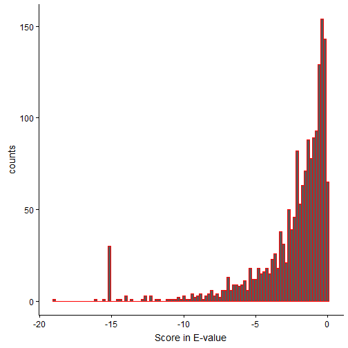
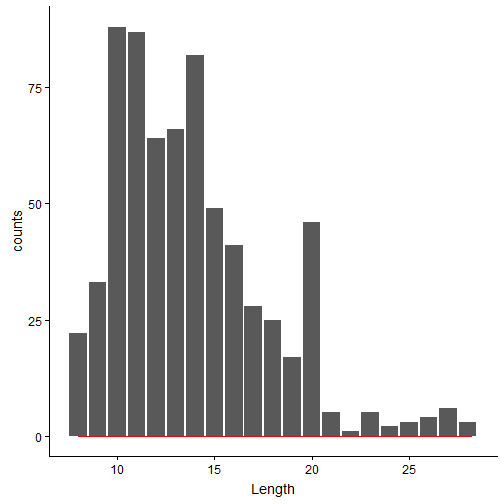

Except for writing scripts in R compared to Python, most of the information is similar to [previous blog](https://sivome.github.io/proteomics/2019/03/11/Reporting_Proteomics_Results.html). Tidyverse is the R package that has combination of packages that are typically used with data-analysis and visualization. Some of the packages built in tidyverse are dplyr, purr, ggplot, tidyr etc.


```r
# loading all the required packages

rm(list=ls())
# we tidyverse that is universe of all data analysis/visualization related packages
library(tidyverse) # May be the title makes sense now?!
library(cowplot)
```

Below is the same OMSSA output file that is used in the [previous blog](https://sivome.github.io/proteomics/2019/03/11/Reporting_Proteomics_Results.html).


```r
OMSSA_output <- read.csv("S288c_run.csv", sep=",", header=TRUE)
head(OMSSA_output)
```

```
##   Spectrum.number Filename.id             Peptide     E.value     Mass gi
## 1             120   index=120           GSIDEQHPR 0.099393924 1037.487  0
## 2             120   index=120           GSIDEQHPR 0.099393924 1037.487  0
## 3             339   index=339     TSGRPIKGDSSAGGK 0.001173798 1416.728  0
## 4             421   index=421     TSGRPIKGDSSAGGK 0.035521953 1416.729  0
## 5             506   index=506  NEETSGEGGEDKNEPSSK 0.028960987 1892.786  0
## 6             514   index=514 ANNSQESNNATSSTSQGTR 0.255100835 1952.833  0
##        Accession Start Stop
## 1   BL_ORD_ID:50   250  258
## 2  BL_ORD_ID:131   250  258
## 3 BL_ORD_ID:2647   176  190
## 4 BL_ORD_ID:2647   176  190
## 5 BL_ORD_ID:4527    76   93
## 6 BL_ORD_ID:1296   748  766
##                                                                                                                                                                     Defline
## 1                                sp|P06169|PDC1_YEAST Pyruvate decarboxylase isozyme 1 OS=Saccharomyces cerevisiae (strain ATCC 204508 / S288c) OX=559292 GN=PDC1 PE=1 SV=7
## 2                                sp|P26263|PDC6_YEAST Pyruvate decarboxylase isozyme 3 OS=Saccharomyces cerevisiae (strain ATCC 204508 / S288c) OX=559292 GN=PDC6 PE=1 SV=3
## 3                                sp|P47075|VTC4_YEAST Vacuolar transporter chaperone 4 OS=Saccharomyces cerevisiae (strain ATCC 204508 / S288c) OX=559292 GN=VTC4 PE=1 SV=2
## 4                                sp|P47075|VTC4_YEAST Vacuolar transporter chaperone 4 OS=Saccharomyces cerevisiae (strain ATCC 204508 / S288c) OX=559292 GN=VTC4 PE=1 SV=2
## 5 sp|Q02776|TIM50_YEAST Mitochondrial import inner membrane translocase subunit TIM50 OS=Saccharomyces cerevisiae (strain ATCC 204508 / S288c) OX=559292 GN=TIM50 PE=1 SV=1
## 6                         sp|P39001|UME6_YEAST Transcriptional regulatory protein UME6 OS=Saccharomyces cerevisiae (strain ATCC 204508 / S288c) OX=559292 GN=UME6 PE=1 SV=2
##   Mods Charge Theo.Mass      P.value NIST.score
## 1           2  1037.490 3.803824e-05          0
## 2           2  1037.490 3.803824e-05          0
## 3           3  1416.731 5.359808e-07          0
## 4           2  1416.731 1.624232e-05          0
## 5           3  1892.789 1.991815e-05          0
## 6           2  1952.844 1.608454e-04          0
```
E-value tells us how significant the hit is i.e., the lower the better. This is similar to BLAST output, if you're familiar with it.

```r
names(OMSSA_output) = gsub("\\.", "", names(OMSSA_output))
Evalplot <- ggplot(OMSSA_output, aes(log10(Evalue))) +
  geom_histogram(color ="red", bins = 100) +
  stat_count() +
  labs(x = "Score in E-value", y = "counts")
Evalplot
```

  

Add 3 new columns (similar to previous blog on reporting proteomics results with jupyter notebook)
1. LengthPep = gets the length of peptide using the peptide string
2. IsReverse = looks for a string match "###REV###" in Defline and gives a value "1" if true, "0" otherwise
3. IsMod = looks for a oxidized MET i.e., lower case M (m) in Peptide and gives a value "1" if true, "0" otherwise

Also, if you notice, the 3 new columns are all related to string parsing i.e., counting letters in peptide, or matching Defline with "###REV###" or matching Mods with "oxidation"!


```r
OMSSA_output = mutate(OMSSA_output, LengthPep = str_count(Peptide))

OMSSA_output = mutate(OMSSA_output, IsReverse = ifelse(grepl("###REV###", Defline), 1, 0))

OMSSA_output = mutate(OMSSA_output, IsMod = ifelse(grepl("oxidation", Mods), 1, 0))
```

Updated OMSSA output after addition of "LengthPep", "IsReverse" and "IsMod" columns.
Scroll to the right of the table to find these new columns! Note the use of "mutate" in adding columns in R.

```r
head(OMSSA_output)
```

```
##   Spectrumnumber Filenameid             Peptide      Evalue     Mass gi
## 1            120  index=120           GSIDEQHPR 0.099393924 1037.487  0
## 2            120  index=120           GSIDEQHPR 0.099393924 1037.487  0
## 3            339  index=339     TSGRPIKGDSSAGGK 0.001173798 1416.728  0
## 4            421  index=421     TSGRPIKGDSSAGGK 0.035521953 1416.729  0
## 5            506  index=506  NEETSGEGGEDKNEPSSK 0.028960987 1892.786  0
## 6            514  index=514 ANNSQESNNATSSTSQGTR 0.255100835 1952.833  0
##        Accession Start Stop
## 1   BL_ORD_ID:50   250  258
## 2  BL_ORD_ID:131   250  258
## 3 BL_ORD_ID:2647   176  190
## 4 BL_ORD_ID:2647   176  190
## 5 BL_ORD_ID:4527    76   93
## 6 BL_ORD_ID:1296   748  766
##                                                                                                                                                                     Defline
## 1                                sp|P06169|PDC1_YEAST Pyruvate decarboxylase isozyme 1 OS=Saccharomyces cerevisiae (strain ATCC 204508 / S288c) OX=559292 GN=PDC1 PE=1 SV=7
## 2                                sp|P26263|PDC6_YEAST Pyruvate decarboxylase isozyme 3 OS=Saccharomyces cerevisiae (strain ATCC 204508 / S288c) OX=559292 GN=PDC6 PE=1 SV=3
## 3                                sp|P47075|VTC4_YEAST Vacuolar transporter chaperone 4 OS=Saccharomyces cerevisiae (strain ATCC 204508 / S288c) OX=559292 GN=VTC4 PE=1 SV=2
## 4                                sp|P47075|VTC4_YEAST Vacuolar transporter chaperone 4 OS=Saccharomyces cerevisiae (strain ATCC 204508 / S288c) OX=559292 GN=VTC4 PE=1 SV=2
## 5 sp|Q02776|TIM50_YEAST Mitochondrial import inner membrane translocase subunit TIM50 OS=Saccharomyces cerevisiae (strain ATCC 204508 / S288c) OX=559292 GN=TIM50 PE=1 SV=1
## 6                         sp|P39001|UME6_YEAST Transcriptional regulatory protein UME6 OS=Saccharomyces cerevisiae (strain ATCC 204508 / S288c) OX=559292 GN=UME6 PE=1 SV=2
##   Mods Charge TheoMass       Pvalue NISTscore LengthPep IsReverse IsMod
## 1           2 1037.490 3.803824e-05         0         9         0     0
## 2           2 1037.490 3.803824e-05         0         9         0     0
## 3           3 1416.731 5.359808e-07         0        15         0     0
## 4           2 1416.731 1.624232e-05         0        15         0     0
## 5           3 1892.789 1.991815e-05         0        18         0     0
## 6           2 1952.844 1.608454e-04         0        19         0     0
```


Let's take a look at the OMSSA hits with and without Reverse matches

```r
EvalplotRev <- ggplot(OMSSA_output, aes(log10(Evalue))) +
  facet_wrap(.~IsReverse) +
  geom_histogram(color ="red", bins = 100) +
  stat_count() +
  labs(x = "Score in E-value", y = "counts")
EvalplotRev
```

  

The right subplot (titled 1, which means IsReverse=True) seems to have scores between greater than 1e-2.
Please note that we used log10 in E-value scores and mentioned that lower E-value the better. (1e-20 is better than 1e-5, for example)

As noted in the previous article, there are better methods to estimate the false discovery rates, and here my goal is to use simple techniques, and at the same time produce efficient results. Since we know the reverse hits fall between 0 and 1e-2, we can use the same logic that some of the forward matches to the databases (i.e., first subplot) might have hits that are not genuine in the bin of [0,1e-2]. We can safely remove this bin for further analyses. Since the end goal of the blog is to introduce OMSSA search results with R tidyverse, an underestimate of true hits (by strict criteria of removing the entire bin) is fine.


```r
filtered_OMSSA_output = filter(OMSSA_output, Evalue < 1e-2)
head(filtered_OMSSA_output)
```

```
##   Spectrumnumber Filenameid                    Peptide       Evalue
## 1            339  index=339            TSGRPIKGDSSAGGK 1.173798e-03
## 2            549  index=549                SRGESDDSLNR 1.937602e-03
## 3            549  index=549                SRGESDDSLNR 1.937602e-03
## 4            583  index=583 ANSDCNDKTDCNANNDCSNESDCNAK 9.257848e-04
## 5            632  index=632         TKTHDVGDEGGNESTKPK 1.004113e-10
## 6            648  index=648       SSDDNNANHPEHQYTKPTRK 2.219034e-03
##       Mass gi      Accession Start Stop
## 1 1416.728  0 BL_ORD_ID:2647   176  190
## 2 1234.551  0  BL_ORD_ID:877    61   71
## 3 1234.551  0  BL_ORD_ID:900    61   71
## 4 2992.052  0 BL_ORD_ID:3714   581  606
## 5 1898.900  0 BL_ORD_ID:6470   645  662
## 6 2338.064  0  BL_ORD_ID:856   958  977
##                                                                                                                                                 Defline
## 1            sp|P47075|VTC4_YEAST Vacuolar transporter chaperone 4 OS=Saccharomyces cerevisiae (strain ATCC 204508 / S288c) OX=559292 GN=VTC4 PE=1 SV=2
## 2              sp|Q3E754|RS21B_YEAST 40S ribosomal protein S21-B OS=Saccharomyces cerevisiae (strain ATCC 204508 / S288c) OX=559292 GN=RPS21B PE=1 SV=1
## 3              sp|P0C0V8|RS21A_YEAST 40S ribosomal protein S21-A OS=Saccharomyces cerevisiae (strain ATCC 204508 / S288c) OX=559292 GN=RPS21A PE=1 SV=1
## 4        sp|Q08732|HRK1_YEAST Serine/threonine-protein kinase HRK1 OS=Saccharomyces cerevisiae (strain ATCC 204508 / S288c) OX=559292 GN=HRK1 PE=1 SV=1
## 5   sp|P47116|PTK2_YEAST Serine/threonine-protein kinase PTK2/STK2 OS=Saccharomyces cerevisiae (strain ATCC 204508 / S288c) OX=559292 GN=PTK2 PE=1 SV=1
## 6 sp|Q12038|SRO7_YEAST Lethal(2) giant larvae protein homolog SRO7 OS=Saccharomyces cerevisiae (strain ATCC 204508 / S288c) OX=559292 GN=SRO7 PE=1 SV=1
##   Mods Charge TheoMass       Pvalue NISTscore LengthPep IsReverse IsMod
## 1           3 1416.731 5.359808e-07         0        15         0     0
## 2           2 1234.554 8.562092e-07         0        11         0     0
## 3           2 1234.554 8.562092e-07         0        11         0     0
## 4           3 2992.055 9.848775e-07         0        26         0     0
## 5           3 1898.898 6.291435e-14         0        18         0     0
## 6           3 2338.071 1.844584e-06         0        20         0     0
```

Of the filtered results, we can further filter out the oxidation cases:


```r
oxidations_only = filter(filtered_OMSSA_output, IsMod>0)
head(oxidations_only)
```

```
##   Spectrumnumber Filenameid             Peptide       Evalue     Mass gi
## 1            729  index=729      SKQEASQmAAmAEK 3.606349e-03 1540.685  0
## 2           1005 index=1005         YATmTGHHVER 6.635733e-03 1316.593  0
## 3           2909 index=2909      SKQEASQmAAMAEK 3.483283e-07 1524.693  0
## 4           2909 index=2909      SKQEASQMAAmAEK 6.834636e-03 1524.693  0
## 5           4663 index=4663      TGTLTTSETAHNmK 1.544400e-05 1506.695  0
## 6           6357 index=6357 mGHSGAIVEGSGTDAESKK 1.819108e-03 1875.860  0
##        Accession Start Stop
## 1 BL_ORD_ID:6013   655  668
## 2 BL_ORD_ID:4636    70   80
## 3 BL_ORD_ID:6013   655  668
## 4 BL_ORD_ID:6013   655  668
## 5 BL_ORD_ID:5833   466  479
## 6 BL_ORD_ID:6570   282  300
##                                                                                                                                                                      Defline
## 1                                 sp|P32589|HSP7F_YEAST Heat shock protein homolog SSE1 OS=Saccharomyces cerevisiae (strain ATCC 204508 / S288c) OX=559292 GN=SSE1 PE=1 SV=4
## 2                             sp|P09436|SYIC_YEAST Isoleucine--tRNA ligase, cytoplasmic OS=Saccharomyces cerevisiae (strain ATCC 204508 / S288c) OX=559292 GN=ILS1 PE=1 SV=1
## 3                                 sp|P32589|HSP7F_YEAST Heat shock protein homolog SSE1 OS=Saccharomyces cerevisiae (strain ATCC 204508 / S288c) OX=559292 GN=SSE1 PE=1 SV=4
## 4                                 sp|P32589|HSP7F_YEAST Heat shock protein homolog SSE1 OS=Saccharomyces cerevisiae (strain ATCC 204508 / S288c) OX=559292 GN=SSE1 PE=1 SV=4
## 5                                               sp|P32324|EF2_YEAST Elongation factor 2 OS=Saccharomyces cerevisiae (strain ATCC 204508 / S288c) OX=559292 GN=EFT1 PE=1 SV=1
## 6 sp|P53598|SUCA_YEAST Succinate--CoA ligase [ADP-forming] subunit alpha, mitochondrial OS=Saccharomyces cerevisiae (strain ATCC 204508 / S288c) OX=559292 GN=LSC1 PE=1 SV=1
##                                  Mods Charge TheoMass       Pvalue
## 1 oxidation of M:8 ,oxidation of M:11      2 1540.687 2.128896e-06
## 2                    oxidation of M:4      2 1316.593 3.218105e-06
## 3                    oxidation of M:8      2 1524.692 1.949235e-10
## 4                   oxidation of M:11      2 1524.692 3.824642e-06
## 5                   oxidation of M:13      3 1506.700 8.014532e-09
## 6                    oxidation of M:1      3 1875.862 1.202319e-06
##   NISTscore LengthPep IsReverse IsMod
## 1         0        14         0     1
## 2         0        11         0     1
## 3         0        14         0     1
## 4         0        14         0     1
## 5         0        14         0     1
## 6         0        19         0     1
```
If you look at the first peptide "SKQEASQmAAmAEK", you can see 2 lowercase M (i.e., -mAAm-) and if you scroll the table to the right and look at the "Mods" column, you can notice "oxidation of M:8 ,oxidation of M:11".

Similar to the previous Jupyter Notebook, we can plot the distributions of Length and Charge.

```r
LengthPepplot <- ggplot(filtered_OMSSA_output, aes(LengthPep)) +
  geom_histogram(color = "red", bins = 100) +
  stat_count() +
  labs(x = "Length", y = "counts")
LengthPepplot
```

  


```r
Chargeplot <- ggplot(filtered_OMSSA_output, aes(Charge)) +
  geom_histogram(color = "red", bins = 5) +
  stat_count() +
  labs(x = "Length", y = "counts")
Chargeplot
```

  

Additionally we can use facet_wrap to look at length distributions for 2+ / 3+ charges separately

```r
LengthPepChargeplot <- ggplot(filtered_OMSSA_output, aes(LengthPep)) +
  facet_wrap(.~Charge) +
  geom_histogram(color = "red", bins = 100) +
  stat_count() +
  labs(x = "Length", y = "counts")
LengthPepChargeplot
```

  

Couple of conclusions can be made from the above subplots:
1. 2+ have more peptide spectral matches, compared to 3+, which is true for most of the datasets.
2. If not significant using one dataset, it can be seen that 3+ might have few longer peptides than 2+.

The OMSSA results used in this blog are the peptide spectral matches for the scans that OMSSA has a hit. However the end goal of any proteomics experiment is to identify the protein present in the sample. For a detailed understanding of how the protein is inferred, given the peptide spectral matches, you can find many publications.

In the earlier blog, with jupyter notebook, I did the following steps:
1. grouping the above results by protein (Accession or Defline)
2. count unique peptides and sort
3. report the top few abundant protein hits.

Here, I take a more conservative approach of "total peptide spectral matches"" per Defline in OMSSA search


```r
protein_list = filtered_OMSSA_output %>% group_by(Defline) %>% summarise(count = n())
protein_list_sorted = protein_list[with(protein_list, order(-count)), ]
head(protein_list_sorted)
```

```
## # A tibble: 6 x 2
##   Defline                                                             count
##   <fct>                                                               <int>
## 1 sp|P00950|PMG1_YEAST Phosphoglycerate mutase 1 OS=Saccharomyces ce~    17
## 2 sp|P31539|HS104_YEAST Heat shock protein 104 OS=Saccharomyces cere~     9
## 3 sp|P39960|BEM2_YEAST GTPase-activating protein BEM2/IPL2 OS=Saccha~     7
## 4 sp|P00445|SODC_YEAST Superoxide dismutase [Cu-Zn] OS=Saccharomyces~     6
## 5 sp|P06634|DED1_YEAST ATP-dependent RNA helicase DED1 OS=Saccharomy~     5
## 6 sp|P17076|RL8A_YEAST 60S ribosomal protein L8-A OS=Saccharomyces c~     5
```
From above, it PMG1_YEAST seem to have a total of 17 peptide spectral matches. In the previous blog, I did report the same protein i.e., PMG1 as abundant, based on count on the unique peptides.
