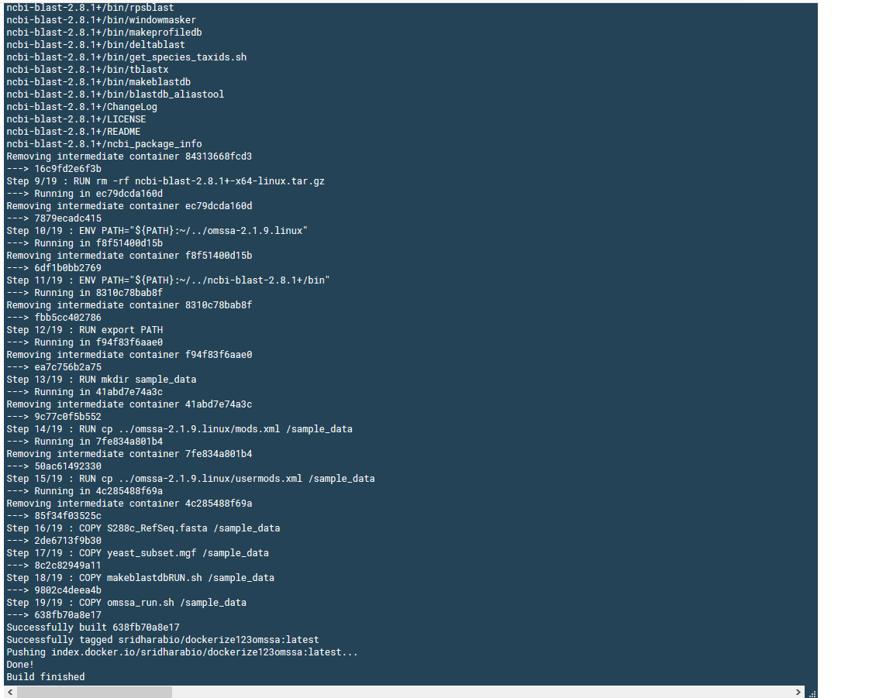

```console
docker pull sridharabio/dockerize123omssa
```

If you’re working in mass-spectrometry based proteomics informatics, you already know the effort it takes to systematically analyze the mass-spec data to generate processed data. For example,
choosing tools to convert raw data to another format,
choosing a database search fasta file for the sample of interest,
choosing sample-specific parameters (e.g., search for phosphorylation on serine/threonine/tyrosine in phospho-sample),
choosing proteomics software depending on the end goals (Identification, Quantitation).


Writing workflows and pipelines in proteomics informatics is still emerging. Proteome Discoverer is one such software where you can embed different software and edit different sections of the pipeline/workflow, depending on the needs. Here, I will NOT focus on any such workflows, but plan to use docker containers to show how docker can be used for proteomics bioinformatics to embed different tools for reproducible research.

For the current blog post, I use linux version of OMSSA that can be found [here](ftp://ftp.ncbi.nih.gov/pub/lewisg/omssa/CURRENT/). I use ubuntu:cosmic within the docker. For makeblastdb, I used ncbi-blast+ that can be found [here](ftp://ftp.ncbi.nlm.nih.gov/blast/executables/blast+/LATEST/).

The end goal of this blog is a docker container that you can use for your proteomics database search with OMSSA. Once you have your (1) your input mgf file and (2) your fasta file of interest, then you can easily tweak the below Dockerfile.

NOTE: Edit the omssa_run.sh file if you want to adjust the search parameters (for example, add phosphorylation as variable modification if you are searching a phosphoproteomics dataset).

Here is the [github link](https://github.com/viswam78/dockerizeOMSSA) that has the same information and the [dockerhub link](https://hub.docker.com/r/sridharabio/dockerize123omssa) to pull the image directly.

Here is how the dockerfile looks like:


```console
FROM ubuntu:cosmic

RUN apt-get update
RUN apt-get install -y wget

RUN wget ftp://ftp.ncbi.nih.gov/pub/lewisg/omssa/CURRENT/omssa-linux.tar.gz
RUN tar -xvf omssa-linux.tar.gz
RUN rm -rf omssa-linux.tar.gz

RUN wget ftp://ftp.ncbi.nlm.nih.gov/blast/executables/blast+/2.8.1/ncbi-blast-2.8.1+-x64-linux.tar.gz
RUN tar -xvf ncbi-blast-2.8.1+-x64-linux.tar.gz
RUN rm -rf ncbi-blast-2.8.1+-x64-linux.tar.gz

ENV PATH="${PATH}:~/../omssa-2.1.9.linux"
ENV PATH="${PATH}:~/../ncbi-blast-2.8.1+/bin"

RUN export PATH

# copy local sample files (mgf, fasta, along with mods.xml and usermods.xml)
RUN mkdir sample_data
RUN cp ../omssa-2.1.9.linux/mods.xml /sample_data
RUN cp ../omssa-2.1.9.linux/usermods.xml /sample_data
COPY S288c_RefSeq.fasta /sample_data
COPY yeast_subset.mgf /sample_data
COPY makeblastdbRUN.sh /sample_data
COPY omssa_run.sh /sample_data
```

I do not want to go through the details of the dockerfile, but all I did was [1] to get the OMSSA and ncbi-blast+ downloads, [2] to copy sample data set, along with the fasta file to the container and [3] to run makeblastdb followed by an OMSSA search.

You can directly pull this image using:
```console
docker pull sridharabio/dockerize123omssa
```

```console
docker run -it sridharabio/dockerize123omssa
```
However if you plan to build the Dockerfile instead (from the github [repo](https://github.com/viswam78/dockerizeOMSSA))
Build the dockerfile using once you:
```console
git clone https://github.com/viswam78/dockerizeOMSSA.git
cd dockerizeOMSSA
docker build .
```

This is how the successful build looks like:



Once you build, you can login to the Ubuntu container with
```console
# docker run -it [ADD build info here]
# From above image, you can see the ID 638fb70a8e17
docker run -it 638fb70a8e17
```

A neat way of doing this is:
```console
# Note the period at the end that builds the Dockerfile
docker build -t name_of_your_choice_for_build .
docker run -it name_of_your_choice_for_build
```

The above Dockerfile has instructions to copy all sample data files to sample_data folder. Once you "docker run", then you will be logged into Ubuntu box. Change directory to sample_data within Ubuntu box using:
```console
cd sample_data
```

To prepare the fasta file for OMSSA searches, you can
```console
bash makeblastdbRUN.sh
```
The above will result in \*.fasta.p\* files for the fasta file.  

For OMSSA search, you can
```console
bash omssa_run.sh
```
This will result in output csv file (output_run.csv) with peptide spectral matches. You can go through my previous blogs to know more about how to analyze the OMSSA search results i.e., peptide spectral matches. That's it for now!


For installing docker, refer to: https://hub.docker.com/

Additional resources:
[Galaxy Proteomics](https://github.com/galaxyproteomics/docker-galaxyp)
