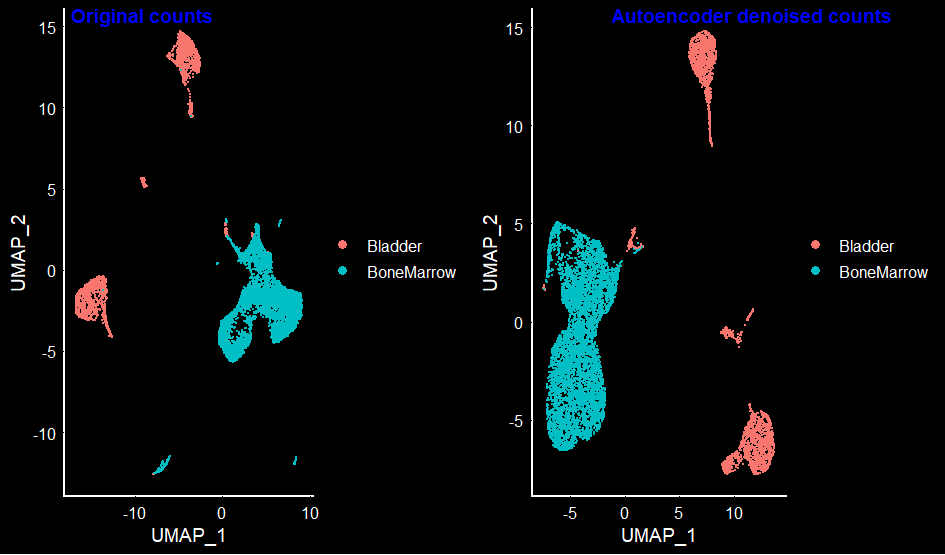

In my previous blog, I used single cell Mouse Cell Atlas [MCA] data to identify clusters and find differentially expressed markers between the clusters. Single cell datasets, in general are sparse, as the number of genes identified is less, compared to bulk RNA-seq experiment. Another reason for sparsity is the number of cells involved, and in most cases, these cells belong to different cell-types leading to expression of different genes in each cell. There are Python modules / R packages that can denoise the single cell counts data and perform imputation (i.e., identify real zeros to possible artifacts caused by single cell sequencing technologies). Some of the programs that does the denoising + imputation on single cell data are DCA, SAVER, MAGIC, scIMPUTE.

Most of these programs use autoencoders (a variant of neural networks) to learn the structure of the data and fill in the missing values. Autoencoder (as the name suggests) has same number of input and output neurons. In single cell case, if the input is counts data of "m" genes and "n" cells, then the output will have the same dimensions, but has a denoised data with reduced sparsity!

Depending on the number of hidden layers, and activation nodes, there could be different variants of the autoencoders. Here, I wrote a script of an autoencoder implementation that uses additional hidden layers compared to above programs. Another reason I made my own implementation is to understand the basic concepts of how these autoencoders work on single cell data.

The input data I used here is the same I used from my previous blog for Seurat marker analyses i.e., counts data of the publicly available mouse cell atlas. The end goal of this task is to compare the clusters and markers identified with the original counts data, and the autoencoder's denoised data.

For this analyses, I  used google colab portal. I uploaded the file that has raw counts of the 2000 variable genes [*chrome browser seems to work well for uploading files*]. Ideally, all the gene counts should be used, but since the variable features are critical in assigning the clusters and _since this is for blog purposes_, I picked only the variable genes. Another reason to use a smaller subset is significant reduction of the computation time.    
```python
# Load local files to google colab
from google.colab import files
uploaded = files.upload()
```

Next, import the data as a pandas data frame.  

```python
import pandas as pd
mca_counts = pd.read_csv("mca.10K.vg.csv", index_col=0)
```
Displaying the top hits of the counts file.  

```python
mca_counts.head()
```


<div>
<style scoped>
    .dataframe tbody tr th:only-of-type {
        vertical-align: middle;
    }

    .dataframe tbody tr th {
        vertical-align: top;
    }

    .dataframe thead th {
        text-align: right;
    }
</style>
<table border="1" class="dataframe">
  <thead>
    <tr style="text-align: right;">
      <th></th>
      <th>Bladder_1.CGGCAGAAAGTTATTCCA</th>
      <th>Bladder_1.CTCGCAAATAAAATCAAC</th>
      <th>Bladder_1.CCATCTAGCGAGTTTAGG</th>
      <th>Bladder_1.GAGGAGCGCTTGATACAG</th>
      <th>Bladder_1.CCAGACACAATAGAATTA</th>
      <th>Bladder_1.CCGACGGGACATATGGCG</th>
      <th>Bladder_1.TAGCATTCAAAGATTCCA</th>
      <th>Bladder_1.CTCCATCCATCTTTTAGG</th>
      <th>Bladder_1.CAAAGTAGGACTAAGTAC</th>
      <th>Bladder_1.TAGCATTGCGGAAACCTA</th>
      <th>Bladder_1.ACACCCACGTTGCACAAG</th>
      <th>Bladder_1.CGCACCATCTCTTAGTCG</th>
      <th>Bladder_1.ACAATAGTCCCGAACGCC</th>
      <th>Bladder_1.CGAGTATAGCATTCAAAG</th>
      <th>Bladder_1.TCGTAATCGGGTGCAGGA</th>
      <th>Bladder_1.ACAATACCGCTATATGTA</th>
      <th>Bladder_1.CGCACCTGATCATTCATA</th>
      <th>Bladder_1.TTCATAGCGAATGTAATG</th>
      <th>Bladder_1.CGCACCTACTTCTCTACC</th>
      <th>Bladder_1.CAACAAGAGATCAACCTA</th>
      <th>Bladder_1.AGGACTCGCACCGAGATC</th>
      <th>Bladder_1.TAGCATCGTATTGCGAAT</th>
      <th>Bladder_1.CCGACGATGCTTCGCTTG</th>
      <th>Bladder_1.TATGTAAAAACGTCTACC</th>
      <th>Bladder_1.CGTATTGATCTTCCTAGA</th>
      <th>Bladder_1.AACCTACAACAAAAAGTT</th>
      <th>Bladder_1.TCACTTGTCGGTTTCATA</th>
      <th>Bladder_1.TTCATATCAAAGTATTGT</th>
      <th>Bladder_1.ACGAGCGAGATCTATTGT</th>
      <th>Bladder_1.AACCTACCATCTGAGGAG</th>
      <th>Bladder_1.AACGCCAAAGTTCCTTTC</th>
      <th>Bladder_1.ACTTATAGTCGTTTTAGG</th>
      <th>Bladder_1.AAGTACATGGCGGCAGGA</th>
      <th>Bladder_1.CATGATAGTCGTCTTCTG</th>
      <th>Bladder_1.AGCGAGAGCGAGAGATGG</th>
      <th>Bladder_1.ACGTTGGTTGCCCATGAT</th>
      <th>Bladder_1.TGATCACACAAGTCAAAG</th>
      <th>Bladder_1.CCTAGATTCCGCGTATAC</th>
      <th>Bladder_1.TTAACTTCGTAAGCAGGA</th>
      <th>Bladder_1.CCAGACATTCCACTGTGT</th>
      <th>...</th>
      <th>BoneMarrow_5.CCTAGACATGATGCTGTG</th>
      <th>BoneMarrow_5.CGCACCATCTCTTGAAGC</th>
      <th>BoneMarrow_5.TGCAATATCTCTACTTAT</th>
      <th>BoneMarrow_5.ACTTATAAAGTTACAATA</th>
      <th>BoneMarrow_5.CACAAGTGCGGATGCGGA</th>
      <th>BoneMarrow_5.CGTATTATTCCATCTACC</th>
      <th>BoneMarrow_5.TGAAGCCCAGACCTCGCA</th>
      <th>BoneMarrow_5.CCTTTCACTTATCTGTGT</th>
      <th>BoneMarrow_5.CGCTTGCACAAGAGGACT</th>
      <th>BoneMarrow_5.TCACTTAGTTTAGCTGTG</th>
      <th>BoneMarrow_5.ACCTGACGTGGCGTATAC</th>
      <th>BoneMarrow_5.TCAAAGCGGCAGGGGCGA</th>
      <th>BoneMarrow_5.ACACCCCTCCATTCTACC</th>
      <th>BoneMarrow_5.GATCTTGGGCGAATGGCG</th>
      <th>BoneMarrow_5.ACTTATGACACTGGCTGC</th>
      <th>BoneMarrow_5.TTTAGGGGCTGCGGCTGC</th>
      <th>BoneMarrow_5.TGATCATCACTTCCAGAC</th>
      <th>BoneMarrow_5.TGCGGAATTCCAGATCTT</th>
      <th>BoneMarrow_5.CAACAAATCTCTCTGAAA</th>
      <th>BoneMarrow_5.ATCAACTTAACTCCAGAC</th>
      <th>BoneMarrow_5.CTCGCATAGAGAGAACGC</th>
      <th>BoneMarrow_5.ACCTGAAACCTAGCGAAT</th>
      <th>BoneMarrow_5.TGATCACCAGACCGAGTA</th>
      <th>BoneMarrow_5.ACGAGCTACTTCACTTAT</th>
      <th>BoneMarrow_5.GATCTTAGGGTCGGACAT</th>
      <th>BoneMarrow_5.GAGGAGGGACATATGCTT</th>
      <th>BoneMarrow_5.TGATCATGATCAAGGACT</th>
      <th>BoneMarrow_5.AAGCGGAACCTAGCTGTG</th>
      <th>BoneMarrow_5.GAGGAGGGACATTCAAAG</th>
      <th>BoneMarrow_5.TGCAATGATCTTGTCCCG</th>
      <th>BoneMarrow_5.ATGGCGAATAAATGCAAT</th>
      <th>BoneMarrow_5.CCTTTCTTTAGGCTGTGT</th>
      <th>BoneMarrow_5.AGGGTCAACCTATGATCA</th>
      <th>BoneMarrow_5.CTGAAAGCAGGATAGAGA</th>
      <th>BoneMarrow_5.CGCTTGCGAGTAGTCGGT</th>
      <th>BoneMarrow_5.CAACAAGTTGCCTATTGT</th>
      <th>BoneMarrow_5.ACCTGACACAAGTTAACT</th>
      <th>BoneMarrow_5.CGTGGCATTTGCGTAATG</th>
      <th>BoneMarrow_5.GCAGGAGTTGCCGGACAT</th>
      <th>BoneMarrow_5.CTCCATTGTCACCGAGTA</th>
    </tr>
  </thead>
  <tbody>
    <tr>
      <th>1110008P14Rik</th>
      <td>6</td>
      <td>2</td>
      <td>6</td>
      <td>5</td>
      <td>7</td>
      <td>8</td>
      <td>7</td>
      <td>6</td>
      <td>5</td>
      <td>8</td>
      <td>7</td>
      <td>9</td>
      <td>7</td>
      <td>10</td>
      <td>6</td>
      <td>3</td>
      <td>6</td>
      <td>5</td>
      <td>5</td>
      <td>8</td>
      <td>3</td>
      <td>5</td>
      <td>5</td>
      <td>1</td>
      <td>2</td>
      <td>2</td>
      <td>2</td>
      <td>3</td>
      <td>6</td>
      <td>5</td>
      <td>2</td>
      <td>3</td>
      <td>7</td>
      <td>1</td>
      <td>5</td>
      <td>6</td>
      <td>5</td>
      <td>2</td>
      <td>3</td>
      <td>2</td>
      <td>...</td>
      <td>0</td>
      <td>0</td>
      <td>0</td>
      <td>0</td>
      <td>0</td>
      <td>0</td>
      <td>0</td>
      <td>0</td>
      <td>0</td>
      <td>0</td>
      <td>0</td>
      <td>0</td>
      <td>0</td>
      <td>0</td>
      <td>0</td>
      <td>0</td>
      <td>0</td>
      <td>0</td>
      <td>0</td>
      <td>0</td>
      <td>0</td>
      <td>0</td>
      <td>0</td>
      <td>0</td>
      <td>0</td>
      <td>0</td>
      <td>0</td>
      <td>0</td>
      <td>1</td>
      <td>1</td>
      <td>0</td>
      <td>0</td>
      <td>0</td>
      <td>0</td>
      <td>0</td>
      <td>0</td>
      <td>0</td>
      <td>0</td>
      <td>0</td>
      <td>0</td>
    </tr>
    <tr>
      <th>1700016P03Rik</th>
      <td>0</td>
      <td>0</td>
      <td>0</td>
      <td>0</td>
      <td>0</td>
      <td>0</td>
      <td>0</td>
      <td>0</td>
      <td>0</td>
      <td>0</td>
      <td>0</td>
      <td>0</td>
      <td>0</td>
      <td>0</td>
      <td>0</td>
      <td>0</td>
      <td>0</td>
      <td>0</td>
      <td>0</td>
      <td>0</td>
      <td>0</td>
      <td>0</td>
      <td>0</td>
      <td>0</td>
      <td>0</td>
      <td>0</td>
      <td>0</td>
      <td>0</td>
      <td>0</td>
      <td>0</td>
      <td>0</td>
      <td>0</td>
      <td>0</td>
      <td>0</td>
      <td>0</td>
      <td>0</td>
      <td>0</td>
      <td>0</td>
      <td>0</td>
      <td>0</td>
      <td>...</td>
      <td>0</td>
      <td>0</td>
      <td>0</td>
      <td>0</td>
      <td>0</td>
      <td>0</td>
      <td>0</td>
      <td>0</td>
      <td>0</td>
      <td>0</td>
      <td>0</td>
      <td>0</td>
      <td>0</td>
      <td>0</td>
      <td>0</td>
      <td>0</td>
      <td>0</td>
      <td>0</td>
      <td>0</td>
      <td>0</td>
      <td>0</td>
      <td>0</td>
      <td>0</td>
      <td>0</td>
      <td>0</td>
      <td>0</td>
      <td>0</td>
      <td>0</td>
      <td>0</td>
      <td>0</td>
      <td>0</td>
      <td>0</td>
      <td>0</td>
      <td>0</td>
      <td>0</td>
      <td>0</td>
      <td>0</td>
      <td>0</td>
      <td>0</td>
      <td>0</td>
    </tr>
    <tr>
      <th>1700027J19Rik</th>
      <td>4</td>
      <td>2</td>
      <td>2</td>
      <td>6</td>
      <td>4</td>
      <td>2</td>
      <td>3</td>
      <td>0</td>
      <td>1</td>
      <td>0</td>
      <td>1</td>
      <td>1</td>
      <td>3</td>
      <td>1</td>
      <td>3</td>
      <td>2</td>
      <td>1</td>
      <td>2</td>
      <td>4</td>
      <td>3</td>
      <td>4</td>
      <td>3</td>
      <td>2</td>
      <td>5</td>
      <td>0</td>
      <td>0</td>
      <td>1</td>
      <td>1</td>
      <td>2</td>
      <td>3</td>
      <td>1</td>
      <td>0</td>
      <td>7</td>
      <td>1</td>
      <td>3</td>
      <td>3</td>
      <td>1</td>
      <td>1</td>
      <td>1</td>
      <td>1</td>
      <td>...</td>
      <td>0</td>
      <td>0</td>
      <td>0</td>
      <td>0</td>
      <td>0</td>
      <td>0</td>
      <td>0</td>
      <td>0</td>
      <td>0</td>
      <td>0</td>
      <td>0</td>
      <td>0</td>
      <td>0</td>
      <td>0</td>
      <td>0</td>
      <td>0</td>
      <td>0</td>
      <td>0</td>
      <td>0</td>
      <td>0</td>
      <td>0</td>
      <td>0</td>
      <td>0</td>
      <td>0</td>
      <td>0</td>
      <td>0</td>
      <td>0</td>
      <td>0</td>
      <td>0</td>
      <td>0</td>
      <td>0</td>
      <td>0</td>
      <td>0</td>
      <td>0</td>
      <td>0</td>
      <td>0</td>
      <td>0</td>
      <td>0</td>
      <td>0</td>
      <td>0</td>
    </tr>
    <tr>
      <th>1700056N10Rik</th>
      <td>0</td>
      <td>0</td>
      <td>0</td>
      <td>0</td>
      <td>0</td>
      <td>0</td>
      <td>0</td>
      <td>0</td>
      <td>0</td>
      <td>0</td>
      <td>0</td>
      <td>0</td>
      <td>0</td>
      <td>0</td>
      <td>0</td>
      <td>0</td>
      <td>0</td>
      <td>0</td>
      <td>0</td>
      <td>0</td>
      <td>0</td>
      <td>0</td>
      <td>0</td>
      <td>0</td>
      <td>0</td>
      <td>0</td>
      <td>0</td>
      <td>0</td>
      <td>0</td>
      <td>0</td>
      <td>0</td>
      <td>0</td>
      <td>0</td>
      <td>0</td>
      <td>0</td>
      <td>0</td>
      <td>0</td>
      <td>0</td>
      <td>0</td>
      <td>0</td>
      <td>...</td>
      <td>0</td>
      <td>0</td>
      <td>0</td>
      <td>0</td>
      <td>0</td>
      <td>0</td>
      <td>0</td>
      <td>0</td>
      <td>0</td>
      <td>0</td>
      <td>0</td>
      <td>0</td>
      <td>0</td>
      <td>0</td>
      <td>0</td>
      <td>0</td>
      <td>0</td>
      <td>0</td>
      <td>0</td>
      <td>0</td>
      <td>0</td>
      <td>0</td>
      <td>0</td>
      <td>0</td>
      <td>0</td>
      <td>0</td>
      <td>0</td>
      <td>0</td>
      <td>0</td>
      <td>0</td>
      <td>0</td>
      <td>0</td>
      <td>0</td>
      <td>0</td>
      <td>0</td>
      <td>0</td>
      <td>0</td>
      <td>0</td>
      <td>0</td>
      <td>0</td>
    </tr>
    <tr>
      <th>1700119H24Rik</th>
      <td>0</td>
      <td>0</td>
      <td>0</td>
      <td>0</td>
      <td>0</td>
      <td>0</td>
      <td>0</td>
      <td>0</td>
      <td>0</td>
      <td>0</td>
      <td>0</td>
      <td>0</td>
      <td>0</td>
      <td>0</td>
      <td>0</td>
      <td>0</td>
      <td>0</td>
      <td>0</td>
      <td>0</td>
      <td>0</td>
      <td>0</td>
      <td>0</td>
      <td>0</td>
      <td>0</td>
      <td>0</td>
      <td>0</td>
      <td>0</td>
      <td>0</td>
      <td>0</td>
      <td>0</td>
      <td>0</td>
      <td>0</td>
      <td>0</td>
      <td>0</td>
      <td>0</td>
      <td>0</td>
      <td>0</td>
      <td>0</td>
      <td>0</td>
      <td>0</td>
      <td>...</td>
      <td>0</td>
      <td>0</td>
      <td>0</td>
      <td>0</td>
      <td>0</td>
      <td>0</td>
      <td>0</td>
      <td>0</td>
      <td>0</td>
      <td>0</td>
      <td>0</td>
      <td>0</td>
      <td>0</td>
      <td>0</td>
      <td>0</td>
      <td>0</td>
      <td>0</td>
      <td>0</td>
      <td>0</td>
      <td>0</td>
      <td>0</td>
      <td>0</td>
      <td>0</td>
      <td>0</td>
      <td>0</td>
      <td>0</td>
      <td>0</td>
      <td>0</td>
      <td>0</td>
      <td>0</td>
      <td>0</td>
      <td>0</td>
      <td>0</td>
      <td>0</td>
      <td>0</td>
      <td>0</td>
      <td>0</td>
      <td>0</td>
      <td>0</td>
      <td>0</td>
    </tr>
  </tbody>
</table>
<p>5 rows × 10000 columns</p>
</div>


Displaying the shape of the counts.  

```python
mca_counts.shape
```


    (2000, 10000)


The dimension of the input data is 2000 variable genes by 10000 cells. This implies that the number of samples is 2000 (in computer vision applications, this can be compared to the number of images used for training). The shape of the input dimension for images in computer vision applications is x by y (or x by y by 3 in case of RGB). In a sample MNIST data, i.e., grey scale low-res image, the size of image is 28 by 28 i.e., 784. Here, the size of the data set (also called the input dimension in neural network nomenclature) is equal to the number of cells considered [here, it is 10K]. Another thing to note is that I used first 10K cells of the 405K cells present in the mouse cell atlas. [*If someone ends up having a good compute, this analyses can be scaled to include all the cells, ideally 95% for training, 4% for validation and 1% for testing*]. If the number of samples is few thousands (say 10K or so, then ratio of 60 : 20 : 20 for training : validation : test makes sense).  

 The input vector of each input neuron is the counts of a particular gene across all cells. In general, counts data are modelled with a poisson distribution (mean and variance are equal) or in most cases, using negative binomial distribution (mean and variance are modelled with 2 parameters). In DCA, and SAVER-X, 2 variants of negative binomial (NB) distribution are implemented, depending on the type of input data used.

The end goal of this blog is to show the _basic details_ of different aspects of denoising single cell data using neural networks such as autoencoders. For accurate classifications and analyses, it is highly recommended to use the above programs such as SAVER-X, DCA etc. Below, I showed few things including [1] generating the input data for the above tools (like SAVERX, DCA), [2] understanding the notation of the neural networks (i.e., training data set size, input dimension of the input layer neurons), [3] neural network model i.e., layers of the autoencoder i.e., input layer + [ encoder layers ] + [ compression layer ] + [ decoder layer ] + [ output layer ], [4] the parameters used to run the neural network to calculate the loss and other metrics, [5] evaluating the model on the input data to generate the denoised + impute version of the original single cell data. Finally, both the original and the basic denoised version of the dataset is fed back (using r-base scale function) into the Seurat for clustering analyses.  

Another difference between the previous implementations and the current one is the number of hidden layers used in encoder and decoder. Unlike one layer of encoder and decoder, I implemented 2 layers with 256 and 64 neurons each. The encoded layers have 256 and 64neurons, while the decoded layers has 256 and 64 neurons with a final output layer having 2000 neurons representing the number of samples. There is a compression layer in between encoder and decoder layers. Except for the activation for the final output layer, all the activations used are ReLU. The output layer has an activation of *sigmoid* function. Regularization might be helpful if the entire data set is used (i.e., counts of all genes and NOT just varying genes).  

In poisson loss function, the loss would equal to the mean([y_pred - y_true * log(y_pred + epsilon)]), where epsilon is a small number to avoid calculating log(0). Also, for Seurat analyses, it would help to use a threshold and set everything below threshold to zero. However, this threshold should be carefully chosen depending on the dataset (for example, looking at the histogram of the predicted output). However, if the threshold is 1e-3, the change is very minor.  


```python
from keras.layers import Input, Dense, BatchNormalization, Dropout, Activation
from keras.models import Model
#from keras.regularizers import l1, L1L2, l2

# Input layer
input_cell = Input(shape=(10000, ))

# Encoded layer 1
encoded = Dense(256, activation='relu')(input_cell) #, activity_regularizer=L1L2(l1=10e-3, l2=10e-5)
encoded = Dropout(rate=0.2)(encoded)

# Encoded layer 2
encoded_2 = Dense(64, activation='relu')(encoded)
encoded_2 = Dropout(rate=0.2)(encoded_2)

# Compression layer 2
compression_layer = Dense(16, activation='relu')(encoded_2)
compression_layer = Dropout(rate=0.2)(compression_layer)

# Decoded layer 2
decoded_2 = Dense(64, activation='relu')(compression_layer)
decoded_2 = Dropout(rate=0.2)(decoded_2)

# Decoded layer 1
decoded = Dense(256, activation='relu')(decoded_2)
decoded = Dropout(rate=0.2)(decoded)

# Output layer
output_cell = Dense(10000, activation='sigmoid')(decoded)

# Defining the entire model
autoencoder = Model(input_cell, output_cell)

# compile the model before fit and predict
autoencoder.compile(optimizer='rmsprop', loss='poisson')

# Summary of the model in tabular format to show the  number of trainable and non-trainable parameters
autoencoder.summary()
```

    Model: "model_16"
    _________________________________________________________________
    Layer (type)                 Output Shape              Param #   
    =================================================================
    input_20 (InputLayer)        (None, 10000)             0         
    _________________________________________________________________
    dense_99 (Dense)             (None, 256)               2560256   
    _________________________________________________________________
    dropout_40 (Dropout)         (None, 256)               0         
    _________________________________________________________________
    dense_100 (Dense)            (None, 64)                16448     
    _________________________________________________________________
    dropout_41 (Dropout)         (None, 64)                0         
    _________________________________________________________________
    dense_101 (Dense)            (None, 16)                1040      
    _________________________________________________________________
    dropout_42 (Dropout)         (None, 16)                0         
    _________________________________________________________________
    dense_102 (Dense)            (None, 64)                1088      
    _________________________________________________________________
    dropout_43 (Dropout)         (None, 64)                0         
    _________________________________________________________________
    dense_103 (Dense)            (None, 256)               16640     
    _________________________________________________________________
    dropout_44 (Dropout)         (None, 256)               0         
    _________________________________________________________________
    dense_104 (Dense)            (None, 10000)             2570000   
    =================================================================
    Total params: 5,165,472
    Trainable params: 5,165,472
    Non-trainable params: 0
    _________________________________________________________________


The number of epochs used is ONLY 20. Ideally this should be large enough to yield a very low validation loss. To save on the compute time, I used few epochs. The other parameter of interest is the validation_split. A validation split of 0.3 below indicates that 30% of the training data is used as a validation set. Here, since the number of samples is 2000, the model will be trained using 70% of the samples (1400) and the remaining 30% is used for validation purposes (i.e., 600 samples).  

```python
# Log normalizing the raw counts and scaling to 10K cells is typically used with all the single cell programs.
mca_counts_lc = mca_counts.max(axis=0)
mca_counts_norm_lc = mca_counts / mca_counts_lc[None, :]

# Fitting the normalized data to the autoencoder model built
autoencoder.fit(mca_counts_norm_lc, mca_counts_norm_lc, epochs = 20, batch_size = 20, validation_split=0.3)# class_weight=mca_lc_weights, sample_weight=mca_counts_gs)

# Predict the output on the same training data [In real world applications, there should be validation data and a separate test data -- for simplicity, I used the same input data here]
mca_counts_norm_lc_output = autoencoder.predict(mca_counts_norm_lc)

```

    Train on 1400 samples, validate on 600 samples
    Epoch 1/20
    1400/1400 [==============================] - 3s 2ms/step - loss: 0.0187 - val_loss: 0.0294
    Epoch 2/20
    1400/1400 [==============================] - 3s 2ms/step - loss: 0.0188 - val_loss: 0.0290
    Epoch 3/20
    1400/1400 [==============================] - 3s 2ms/step - loss: 0.0187 - val_loss: 0.0294
    Epoch 4/20
    1400/1400 [==============================] - 3s 2ms/step - loss: 0.0189 - val_loss: 0.0298
    Epoch 5/20
    1400/1400 [==============================] - 3s 2ms/step - loss: 0.0185 - val_loss: 0.0289
    Epoch 6/20
    1400/1400 [==============================] - 3s 2ms/step - loss: 0.0186 - val_loss: 0.0298
    Epoch 7/20
    1400/1400 [==============================] - 3s 2ms/step - loss: 0.0187 - val_loss: 0.0301
    Epoch 8/20
    1400/1400 [==============================] - 3s 2ms/step - loss: 0.0187 - val_loss: 0.0302
    Epoch 9/20
    1400/1400 [==============================] - 3s 2ms/step - loss: 0.0189 - val_loss: 0.0298
    Epoch 10/20
    1400/1400 [==============================] - 3s 2ms/step - loss: 0.0188 - val_loss: 0.0297
    Epoch 11/20
    1400/1400 [==============================] - 3s 2ms/step - loss: 0.0185 - val_loss: 0.0299
    Epoch 12/20
    1400/1400 [==============================] - 3s 2ms/step - loss: 0.0188 - val_loss: 0.0296
    Epoch 13/20
    1400/1400 [==============================] - 3s 2ms/step - loss: 0.0185 - val_loss: 0.0300
    Epoch 14/20
    1400/1400 [==============================] - 3s 2ms/step - loss: 0.0184 - val_loss: 0.0291
    Epoch 15/20
    1400/1400 [==============================] - 3s 2ms/step - loss: 0.0188 - val_loss: 0.0291
    Epoch 16/20
    1400/1400 [==============================] - 3s 2ms/step - loss: 0.0186 - val_loss: 0.0295
    Epoch 17/20
    1400/1400 [==============================] - 3s 2ms/step - loss: 0.0185 - val_loss: 0.0294
    Epoch 18/20
    1400/1400 [==============================] - 3s 2ms/step - loss: 0.0186 - val_loss: 0.0293
    Epoch 19/20
    1400/1400 [==============================] - 4s 3ms/step - loss: 0.0185 - val_loss: 0.0293
    Epoch 20/20
    1400/1400 [==============================] - 4s 3ms/step - loss: 0.0185 - val_loss: 0.0297


```python
mca_counts_norm_lc_output[0:4, 0:4]
```
    array([[0.01773182, 0.02895972, 0.01728064, 0.01625928],
           [0.00141433, 0.00209311, 0.00145644, 0.0011279 ],
           [0.02724421, 0.04175797, 0.02742231, 0.02623108],
           [0.0013988 , 0.00204527, 0.00144061, 0.00110739]], dtype=float32)


```python
mca_counts_norm_lc.head()
```


<div>
<style scoped>
    .dataframe tbody tr th:only-of-type {
        vertical-align: middle;
    }

    .dataframe tbody tr th {
        vertical-align: top;
    }

    .dataframe thead th {
        text-align: right;
    }
</style>
<table border="1" class="dataframe">
  <thead>
    <tr style="text-align: right;">
      <th></th>
      <th>Bladder_1.CGGCAGAAAGTTATTCCA</th>
      <th>Bladder_1.CTCGCAAATAAAATCAAC</th>
      <th>Bladder_1.CCATCTAGCGAGTTTAGG</th>
      <th>Bladder_1.GAGGAGCGCTTGATACAG</th>
      <th>Bladder_1.CCAGACACAATAGAATTA</th>
      <th>Bladder_1.CCGACGGGACATATGGCG</th>
      <th>Bladder_1.TAGCATTCAAAGATTCCA</th>
      <th>Bladder_1.CTCCATCCATCTTTTAGG</th>
      <th>Bladder_1.CAAAGTAGGACTAAGTAC</th>
      <th>Bladder_1.TAGCATTGCGGAAACCTA</th>
      <th>Bladder_1.ACACCCACGTTGCACAAG</th>
      <th>Bladder_1.CGCACCATCTCTTAGTCG</th>
      <th>Bladder_1.ACAATAGTCCCGAACGCC</th>
      <th>Bladder_1.CGAGTATAGCATTCAAAG</th>
      <th>Bladder_1.TCGTAATCGGGTGCAGGA</th>
      <th>Bladder_1.ACAATACCGCTATATGTA</th>
      <th>Bladder_1.CGCACCTGATCATTCATA</th>
      <th>Bladder_1.TTCATAGCGAATGTAATG</th>
      <th>Bladder_1.CGCACCTACTTCTCTACC</th>
      <th>Bladder_1.CAACAAGAGATCAACCTA</th>
      <th>Bladder_1.AGGACTCGCACCGAGATC</th>
      <th>Bladder_1.TAGCATCGTATTGCGAAT</th>
      <th>Bladder_1.CCGACGATGCTTCGCTTG</th>
      <th>Bladder_1.TATGTAAAAACGTCTACC</th>
      <th>Bladder_1.CGTATTGATCTTCCTAGA</th>
      <th>Bladder_1.AACCTACAACAAAAAGTT</th>
      <th>Bladder_1.TCACTTGTCGGTTTCATA</th>
      <th>Bladder_1.TTCATATCAAAGTATTGT</th>
      <th>Bladder_1.ACGAGCGAGATCTATTGT</th>
      <th>Bladder_1.AACCTACCATCTGAGGAG</th>
      <th>Bladder_1.AACGCCAAAGTTCCTTTC</th>
      <th>Bladder_1.ACTTATAGTCGTTTTAGG</th>
      <th>Bladder_1.AAGTACATGGCGGCAGGA</th>
      <th>Bladder_1.CATGATAGTCGTCTTCTG</th>
      <th>Bladder_1.AGCGAGAGCGAGAGATGG</th>
      <th>Bladder_1.ACGTTGGTTGCCCATGAT</th>
      <th>Bladder_1.TGATCACACAAGTCAAAG</th>
      <th>Bladder_1.CCTAGATTCCGCGTATAC</th>
      <th>Bladder_1.TTAACTTCGTAAGCAGGA</th>
      <th>Bladder_1.CCAGACATTCCACTGTGT</th>
      <th>...</th>
      <th>BoneMarrow_5.CCTAGACATGATGCTGTG</th>
      <th>BoneMarrow_5.CGCACCATCTCTTGAAGC</th>
      <th>BoneMarrow_5.TGCAATATCTCTACTTAT</th>
      <th>BoneMarrow_5.ACTTATAAAGTTACAATA</th>
      <th>BoneMarrow_5.CACAAGTGCGGATGCGGA</th>
      <th>BoneMarrow_5.CGTATTATTCCATCTACC</th>
      <th>BoneMarrow_5.TGAAGCCCAGACCTCGCA</th>
      <th>BoneMarrow_5.CCTTTCACTTATCTGTGT</th>
      <th>BoneMarrow_5.CGCTTGCACAAGAGGACT</th>
      <th>BoneMarrow_5.TCACTTAGTTTAGCTGTG</th>
      <th>BoneMarrow_5.ACCTGACGTGGCGTATAC</th>
      <th>BoneMarrow_5.TCAAAGCGGCAGGGGCGA</th>
      <th>BoneMarrow_5.ACACCCCTCCATTCTACC</th>
      <th>BoneMarrow_5.GATCTTGGGCGAATGGCG</th>
      <th>BoneMarrow_5.ACTTATGACACTGGCTGC</th>
      <th>BoneMarrow_5.TTTAGGGGCTGCGGCTGC</th>
      <th>BoneMarrow_5.TGATCATCACTTCCAGAC</th>
      <th>BoneMarrow_5.TGCGGAATTCCAGATCTT</th>
      <th>BoneMarrow_5.CAACAAATCTCTCTGAAA</th>
      <th>BoneMarrow_5.ATCAACTTAACTCCAGAC</th>
      <th>BoneMarrow_5.CTCGCATAGAGAGAACGC</th>
      <th>BoneMarrow_5.ACCTGAAACCTAGCGAAT</th>
      <th>BoneMarrow_5.TGATCACCAGACCGAGTA</th>
      <th>BoneMarrow_5.ACGAGCTACTTCACTTAT</th>
      <th>BoneMarrow_5.GATCTTAGGGTCGGACAT</th>
      <th>BoneMarrow_5.GAGGAGGGACATATGCTT</th>
      <th>BoneMarrow_5.TGATCATGATCAAGGACT</th>
      <th>BoneMarrow_5.AAGCGGAACCTAGCTGTG</th>
      <th>BoneMarrow_5.GAGGAGGGACATTCAAAG</th>
      <th>BoneMarrow_5.TGCAATGATCTTGTCCCG</th>
      <th>BoneMarrow_5.ATGGCGAATAAATGCAAT</th>
      <th>BoneMarrow_5.CCTTTCTTTAGGCTGTGT</th>
      <th>BoneMarrow_5.AGGGTCAACCTATGATCA</th>
      <th>BoneMarrow_5.CTGAAAGCAGGATAGAGA</th>
      <th>BoneMarrow_5.CGCTTGCGAGTAGTCGGT</th>
      <th>BoneMarrow_5.CAACAAGTTGCCTATTGT</th>
      <th>BoneMarrow_5.ACCTGACACAAGTTAACT</th>
      <th>BoneMarrow_5.CGTGGCATTTGCGTAATG</th>
      <th>BoneMarrow_5.GCAGGAGTTGCCGGACAT</th>
      <th>BoneMarrow_5.CTCCATTGTCACCGAGTA</th>
    </tr>
  </thead>
  <tbody>
    <tr>
      <th>1110008P14Rik</th>
      <td>0.018987</td>
      <td>0.009259</td>
      <td>0.024194</td>
      <td>0.016722</td>
      <td>0.026515</td>
      <td>0.028777</td>
      <td>0.026217</td>
      <td>0.023346</td>
      <td>0.019157</td>
      <td>0.030303</td>
      <td>0.026415</td>
      <td>0.03321</td>
      <td>0.028340</td>
      <td>0.048077</td>
      <td>0.020690</td>
      <td>0.011450</td>
      <td>0.024096</td>
      <td>0.024390</td>
      <td>0.017794</td>
      <td>0.042553</td>
      <td>0.012295</td>
      <td>0.023148</td>
      <td>0.023256</td>
      <td>0.004630</td>
      <td>0.007752</td>
      <td>0.008511</td>
      <td>0.008230</td>
      <td>0.014286</td>
      <td>0.025424</td>
      <td>0.023364</td>
      <td>0.009091</td>
      <td>0.013274</td>
      <td>0.036842</td>
      <td>0.004717</td>
      <td>0.022422</td>
      <td>0.024590</td>
      <td>0.020833</td>
      <td>0.007722</td>
      <td>0.012712</td>
      <td>0.009302</td>
      <td>...</td>
      <td>0.0</td>
      <td>0.0</td>
      <td>0.0</td>
      <td>0.0</td>
      <td>0.0</td>
      <td>0.0</td>
      <td>0.0</td>
      <td>0.0</td>
      <td>0.0</td>
      <td>0.0</td>
      <td>0.0</td>
      <td>0.0</td>
      <td>0.0</td>
      <td>0.0</td>
      <td>0.0</td>
      <td>0.0</td>
      <td>0.0</td>
      <td>0.0</td>
      <td>0.0</td>
      <td>0.0</td>
      <td>0.0</td>
      <td>0.0</td>
      <td>0.0</td>
      <td>0.0</td>
      <td>0.0</td>
      <td>0.0</td>
      <td>0.0</td>
      <td>0.0</td>
      <td>0.25</td>
      <td>0.05</td>
      <td>0.0</td>
      <td>0.0</td>
      <td>0.0</td>
      <td>0.0</td>
      <td>0.0</td>
      <td>0.0</td>
      <td>0.0</td>
      <td>0.0</td>
      <td>0.0</td>
      <td>0.0</td>
    </tr>
    <tr>
      <th>1700016P03Rik</th>
      <td>0.000000</td>
      <td>0.000000</td>
      <td>0.000000</td>
      <td>0.000000</td>
      <td>0.000000</td>
      <td>0.000000</td>
      <td>0.000000</td>
      <td>0.000000</td>
      <td>0.000000</td>
      <td>0.000000</td>
      <td>0.000000</td>
      <td>0.00000</td>
      <td>0.000000</td>
      <td>0.000000</td>
      <td>0.000000</td>
      <td>0.000000</td>
      <td>0.000000</td>
      <td>0.000000</td>
      <td>0.000000</td>
      <td>0.000000</td>
      <td>0.000000</td>
      <td>0.000000</td>
      <td>0.000000</td>
      <td>0.000000</td>
      <td>0.000000</td>
      <td>0.000000</td>
      <td>0.000000</td>
      <td>0.000000</td>
      <td>0.000000</td>
      <td>0.000000</td>
      <td>0.000000</td>
      <td>0.000000</td>
      <td>0.000000</td>
      <td>0.000000</td>
      <td>0.000000</td>
      <td>0.000000</td>
      <td>0.000000</td>
      <td>0.000000</td>
      <td>0.000000</td>
      <td>0.000000</td>
      <td>...</td>
      <td>0.0</td>
      <td>0.0</td>
      <td>0.0</td>
      <td>0.0</td>
      <td>0.0</td>
      <td>0.0</td>
      <td>0.0</td>
      <td>0.0</td>
      <td>0.0</td>
      <td>0.0</td>
      <td>0.0</td>
      <td>0.0</td>
      <td>0.0</td>
      <td>0.0</td>
      <td>0.0</td>
      <td>0.0</td>
      <td>0.0</td>
      <td>0.0</td>
      <td>0.0</td>
      <td>0.0</td>
      <td>0.0</td>
      <td>0.0</td>
      <td>0.0</td>
      <td>0.0</td>
      <td>0.0</td>
      <td>0.0</td>
      <td>0.0</td>
      <td>0.0</td>
      <td>0.00</td>
      <td>0.00</td>
      <td>0.0</td>
      <td>0.0</td>
      <td>0.0</td>
      <td>0.0</td>
      <td>0.0</td>
      <td>0.0</td>
      <td>0.0</td>
      <td>0.0</td>
      <td>0.0</td>
      <td>0.0</td>
    </tr>
    <tr>
      <th>1700027J19Rik</th>
      <td>0.012658</td>
      <td>0.009259</td>
      <td>0.008065</td>
      <td>0.020067</td>
      <td>0.015152</td>
      <td>0.007194</td>
      <td>0.011236</td>
      <td>0.000000</td>
      <td>0.003831</td>
      <td>0.000000</td>
      <td>0.003774</td>
      <td>0.00369</td>
      <td>0.012146</td>
      <td>0.004808</td>
      <td>0.010345</td>
      <td>0.007634</td>
      <td>0.004016</td>
      <td>0.009756</td>
      <td>0.014235</td>
      <td>0.015957</td>
      <td>0.016393</td>
      <td>0.013889</td>
      <td>0.009302</td>
      <td>0.023148</td>
      <td>0.000000</td>
      <td>0.000000</td>
      <td>0.004115</td>
      <td>0.004762</td>
      <td>0.008475</td>
      <td>0.014019</td>
      <td>0.004545</td>
      <td>0.000000</td>
      <td>0.036842</td>
      <td>0.004717</td>
      <td>0.013453</td>
      <td>0.012295</td>
      <td>0.004167</td>
      <td>0.003861</td>
      <td>0.004237</td>
      <td>0.004651</td>
      <td>...</td>
      <td>0.0</td>
      <td>0.0</td>
      <td>0.0</td>
      <td>0.0</td>
      <td>0.0</td>
      <td>0.0</td>
      <td>0.0</td>
      <td>0.0</td>
      <td>0.0</td>
      <td>0.0</td>
      <td>0.0</td>
      <td>0.0</td>
      <td>0.0</td>
      <td>0.0</td>
      <td>0.0</td>
      <td>0.0</td>
      <td>0.0</td>
      <td>0.0</td>
      <td>0.0</td>
      <td>0.0</td>
      <td>0.0</td>
      <td>0.0</td>
      <td>0.0</td>
      <td>0.0</td>
      <td>0.0</td>
      <td>0.0</td>
      <td>0.0</td>
      <td>0.0</td>
      <td>0.00</td>
      <td>0.00</td>
      <td>0.0</td>
      <td>0.0</td>
      <td>0.0</td>
      <td>0.0</td>
      <td>0.0</td>
      <td>0.0</td>
      <td>0.0</td>
      <td>0.0</td>
      <td>0.0</td>
      <td>0.0</td>
    </tr>
    <tr>
      <th>1700056N10Rik</th>
      <td>0.000000</td>
      <td>0.000000</td>
      <td>0.000000</td>
      <td>0.000000</td>
      <td>0.000000</td>
      <td>0.000000</td>
      <td>0.000000</td>
      <td>0.000000</td>
      <td>0.000000</td>
      <td>0.000000</td>
      <td>0.000000</td>
      <td>0.00000</td>
      <td>0.000000</td>
      <td>0.000000</td>
      <td>0.000000</td>
      <td>0.000000</td>
      <td>0.000000</td>
      <td>0.000000</td>
      <td>0.000000</td>
      <td>0.000000</td>
      <td>0.000000</td>
      <td>0.000000</td>
      <td>0.000000</td>
      <td>0.000000</td>
      <td>0.000000</td>
      <td>0.000000</td>
      <td>0.000000</td>
      <td>0.000000</td>
      <td>0.000000</td>
      <td>0.000000</td>
      <td>0.000000</td>
      <td>0.000000</td>
      <td>0.000000</td>
      <td>0.000000</td>
      <td>0.000000</td>
      <td>0.000000</td>
      <td>0.000000</td>
      <td>0.000000</td>
      <td>0.000000</td>
      <td>0.000000</td>
      <td>...</td>
      <td>0.0</td>
      <td>0.0</td>
      <td>0.0</td>
      <td>0.0</td>
      <td>0.0</td>
      <td>0.0</td>
      <td>0.0</td>
      <td>0.0</td>
      <td>0.0</td>
      <td>0.0</td>
      <td>0.0</td>
      <td>0.0</td>
      <td>0.0</td>
      <td>0.0</td>
      <td>0.0</td>
      <td>0.0</td>
      <td>0.0</td>
      <td>0.0</td>
      <td>0.0</td>
      <td>0.0</td>
      <td>0.0</td>
      <td>0.0</td>
      <td>0.0</td>
      <td>0.0</td>
      <td>0.0</td>
      <td>0.0</td>
      <td>0.0</td>
      <td>0.0</td>
      <td>0.00</td>
      <td>0.00</td>
      <td>0.0</td>
      <td>0.0</td>
      <td>0.0</td>
      <td>0.0</td>
      <td>0.0</td>
      <td>0.0</td>
      <td>0.0</td>
      <td>0.0</td>
      <td>0.0</td>
      <td>0.0</td>
    </tr>
    <tr>
      <th>1700119H24Rik</th>
      <td>0.000000</td>
      <td>0.000000</td>
      <td>0.000000</td>
      <td>0.000000</td>
      <td>0.000000</td>
      <td>0.000000</td>
      <td>0.000000</td>
      <td>0.000000</td>
      <td>0.000000</td>
      <td>0.000000</td>
      <td>0.000000</td>
      <td>0.00000</td>
      <td>0.000000</td>
      <td>0.000000</td>
      <td>0.000000</td>
      <td>0.000000</td>
      <td>0.000000</td>
      <td>0.000000</td>
      <td>0.000000</td>
      <td>0.000000</td>
      <td>0.000000</td>
      <td>0.000000</td>
      <td>0.000000</td>
      <td>0.000000</td>
      <td>0.000000</td>
      <td>0.000000</td>
      <td>0.000000</td>
      <td>0.000000</td>
      <td>0.000000</td>
      <td>0.000000</td>
      <td>0.000000</td>
      <td>0.000000</td>
      <td>0.000000</td>
      <td>0.000000</td>
      <td>0.000000</td>
      <td>0.000000</td>
      <td>0.000000</td>
      <td>0.000000</td>
      <td>0.000000</td>
      <td>0.000000</td>
      <td>...</td>
      <td>0.0</td>
      <td>0.0</td>
      <td>0.0</td>
      <td>0.0</td>
      <td>0.0</td>
      <td>0.0</td>
      <td>0.0</td>
      <td>0.0</td>
      <td>0.0</td>
      <td>0.0</td>
      <td>0.0</td>
      <td>0.0</td>
      <td>0.0</td>
      <td>0.0</td>
      <td>0.0</td>
      <td>0.0</td>
      <td>0.0</td>
      <td>0.0</td>
      <td>0.0</td>
      <td>0.0</td>
      <td>0.0</td>
      <td>0.0</td>
      <td>0.0</td>
      <td>0.0</td>
      <td>0.0</td>
      <td>0.0</td>
      <td>0.0</td>
      <td>0.0</td>
      <td>0.00</td>
      <td>0.00</td>
      <td>0.0</td>
      <td>0.0</td>
      <td>0.0</td>
      <td>0.0</td>
      <td>0.0</td>
      <td>0.0</td>
      <td>0.0</td>
      <td>0.0</td>
      <td>0.0</td>
      <td>0.0</td>
    </tr>
  </tbody>
</table>
<p>5 rows × 10000 columns</p>
</div>


```python
mca_counts_norm_lc_output.sum(axis=1)
```


    array([185.41336  ,   5.728099 ,  47.230495 , ...,   5.7145967,
             6.331905 ,   5.6825914], dtype=float32)


```python
mca_counts.head()
```


<div>
<style scoped>
    .dataframe tbody tr th:only-of-type {
        vertical-align: middle;
    }

    .dataframe tbody tr th {
        vertical-align: top;
    }

    .dataframe thead th {
        text-align: right;
    }
</style>
<table border="1" class="dataframe">
  <thead>
    <tr style="text-align: right;">
      <th></th>
      <th>Bladder_1.CGGCAGAAAGTTATTCCA</th>
      <th>Bladder_1.CTCGCAAATAAAATCAAC</th>
      <th>Bladder_1.CCATCTAGCGAGTTTAGG</th>
      <th>Bladder_1.GAGGAGCGCTTGATACAG</th>
      <th>Bladder_1.CCAGACACAATAGAATTA</th>
      <th>Bladder_1.CCGACGGGACATATGGCG</th>
      <th>Bladder_1.TAGCATTCAAAGATTCCA</th>
      <th>Bladder_1.CTCCATCCATCTTTTAGG</th>
      <th>Bladder_1.CAAAGTAGGACTAAGTAC</th>
      <th>Bladder_1.TAGCATTGCGGAAACCTA</th>
      <th>Bladder_1.ACACCCACGTTGCACAAG</th>
      <th>Bladder_1.CGCACCATCTCTTAGTCG</th>
      <th>Bladder_1.ACAATAGTCCCGAACGCC</th>
      <th>Bladder_1.CGAGTATAGCATTCAAAG</th>
      <th>Bladder_1.TCGTAATCGGGTGCAGGA</th>
      <th>Bladder_1.ACAATACCGCTATATGTA</th>
      <th>Bladder_1.CGCACCTGATCATTCATA</th>
      <th>Bladder_1.TTCATAGCGAATGTAATG</th>
      <th>Bladder_1.CGCACCTACTTCTCTACC</th>
      <th>Bladder_1.CAACAAGAGATCAACCTA</th>
      <th>Bladder_1.AGGACTCGCACCGAGATC</th>
      <th>Bladder_1.TAGCATCGTATTGCGAAT</th>
      <th>Bladder_1.CCGACGATGCTTCGCTTG</th>
      <th>Bladder_1.TATGTAAAAACGTCTACC</th>
      <th>Bladder_1.CGTATTGATCTTCCTAGA</th>
      <th>Bladder_1.AACCTACAACAAAAAGTT</th>
      <th>Bladder_1.TCACTTGTCGGTTTCATA</th>
      <th>Bladder_1.TTCATATCAAAGTATTGT</th>
      <th>Bladder_1.ACGAGCGAGATCTATTGT</th>
      <th>Bladder_1.AACCTACCATCTGAGGAG</th>
      <th>Bladder_1.AACGCCAAAGTTCCTTTC</th>
      <th>Bladder_1.ACTTATAGTCGTTTTAGG</th>
      <th>Bladder_1.AAGTACATGGCGGCAGGA</th>
      <th>Bladder_1.CATGATAGTCGTCTTCTG</th>
      <th>Bladder_1.AGCGAGAGCGAGAGATGG</th>
      <th>Bladder_1.ACGTTGGTTGCCCATGAT</th>
      <th>Bladder_1.TGATCACACAAGTCAAAG</th>
      <th>Bladder_1.CCTAGATTCCGCGTATAC</th>
      <th>Bladder_1.TTAACTTCGTAAGCAGGA</th>
      <th>Bladder_1.CCAGACATTCCACTGTGT</th>
      <th>...</th>
      <th>BoneMarrow_5.CCTAGACATGATGCTGTG</th>
      <th>BoneMarrow_5.CGCACCATCTCTTGAAGC</th>
      <th>BoneMarrow_5.TGCAATATCTCTACTTAT</th>
      <th>BoneMarrow_5.ACTTATAAAGTTACAATA</th>
      <th>BoneMarrow_5.CACAAGTGCGGATGCGGA</th>
      <th>BoneMarrow_5.CGTATTATTCCATCTACC</th>
      <th>BoneMarrow_5.TGAAGCCCAGACCTCGCA</th>
      <th>BoneMarrow_5.CCTTTCACTTATCTGTGT</th>
      <th>BoneMarrow_5.CGCTTGCACAAGAGGACT</th>
      <th>BoneMarrow_5.TCACTTAGTTTAGCTGTG</th>
      <th>BoneMarrow_5.ACCTGACGTGGCGTATAC</th>
      <th>BoneMarrow_5.TCAAAGCGGCAGGGGCGA</th>
      <th>BoneMarrow_5.ACACCCCTCCATTCTACC</th>
      <th>BoneMarrow_5.GATCTTGGGCGAATGGCG</th>
      <th>BoneMarrow_5.ACTTATGACACTGGCTGC</th>
      <th>BoneMarrow_5.TTTAGGGGCTGCGGCTGC</th>
      <th>BoneMarrow_5.TGATCATCACTTCCAGAC</th>
      <th>BoneMarrow_5.TGCGGAATTCCAGATCTT</th>
      <th>BoneMarrow_5.CAACAAATCTCTCTGAAA</th>
      <th>BoneMarrow_5.ATCAACTTAACTCCAGAC</th>
      <th>BoneMarrow_5.CTCGCATAGAGAGAACGC</th>
      <th>BoneMarrow_5.ACCTGAAACCTAGCGAAT</th>
      <th>BoneMarrow_5.TGATCACCAGACCGAGTA</th>
      <th>BoneMarrow_5.ACGAGCTACTTCACTTAT</th>
      <th>BoneMarrow_5.GATCTTAGGGTCGGACAT</th>
      <th>BoneMarrow_5.GAGGAGGGACATATGCTT</th>
      <th>BoneMarrow_5.TGATCATGATCAAGGACT</th>
      <th>BoneMarrow_5.AAGCGGAACCTAGCTGTG</th>
      <th>BoneMarrow_5.GAGGAGGGACATTCAAAG</th>
      <th>BoneMarrow_5.TGCAATGATCTTGTCCCG</th>
      <th>BoneMarrow_5.ATGGCGAATAAATGCAAT</th>
      <th>BoneMarrow_5.CCTTTCTTTAGGCTGTGT</th>
      <th>BoneMarrow_5.AGGGTCAACCTATGATCA</th>
      <th>BoneMarrow_5.CTGAAAGCAGGATAGAGA</th>
      <th>BoneMarrow_5.CGCTTGCGAGTAGTCGGT</th>
      <th>BoneMarrow_5.CAACAAGTTGCCTATTGT</th>
      <th>BoneMarrow_5.ACCTGACACAAGTTAACT</th>
      <th>BoneMarrow_5.CGTGGCATTTGCGTAATG</th>
      <th>BoneMarrow_5.GCAGGAGTTGCCGGACAT</th>
      <th>BoneMarrow_5.CTCCATTGTCACCGAGTA</th>
    </tr>
  </thead>
  <tbody>
    <tr>
      <th>1110008P14Rik</th>
      <td>6</td>
      <td>2</td>
      <td>6</td>
      <td>5</td>
      <td>7</td>
      <td>8</td>
      <td>7</td>
      <td>6</td>
      <td>5</td>
      <td>8</td>
      <td>7</td>
      <td>9</td>
      <td>7</td>
      <td>10</td>
      <td>6</td>
      <td>3</td>
      <td>6</td>
      <td>5</td>
      <td>5</td>
      <td>8</td>
      <td>3</td>
      <td>5</td>
      <td>5</td>
      <td>1</td>
      <td>2</td>
      <td>2</td>
      <td>2</td>
      <td>3</td>
      <td>6</td>
      <td>5</td>
      <td>2</td>
      <td>3</td>
      <td>7</td>
      <td>1</td>
      <td>5</td>
      <td>6</td>
      <td>5</td>
      <td>2</td>
      <td>3</td>
      <td>2</td>
      <td>...</td>
      <td>0</td>
      <td>0</td>
      <td>0</td>
      <td>0</td>
      <td>0</td>
      <td>0</td>
      <td>0</td>
      <td>0</td>
      <td>0</td>
      <td>0</td>
      <td>0</td>
      <td>0</td>
      <td>0</td>
      <td>0</td>
      <td>0</td>
      <td>0</td>
      <td>0</td>
      <td>0</td>
      <td>0</td>
      <td>0</td>
      <td>0</td>
      <td>0</td>
      <td>0</td>
      <td>0</td>
      <td>0</td>
      <td>0</td>
      <td>0</td>
      <td>0</td>
      <td>1</td>
      <td>1</td>
      <td>0</td>
      <td>0</td>
      <td>0</td>
      <td>0</td>
      <td>0</td>
      <td>0</td>
      <td>0</td>
      <td>0</td>
      <td>0</td>
      <td>0</td>
    </tr>
    <tr>
      <th>1700016P03Rik</th>
      <td>0</td>
      <td>0</td>
      <td>0</td>
      <td>0</td>
      <td>0</td>
      <td>0</td>
      <td>0</td>
      <td>0</td>
      <td>0</td>
      <td>0</td>
      <td>0</td>
      <td>0</td>
      <td>0</td>
      <td>0</td>
      <td>0</td>
      <td>0</td>
      <td>0</td>
      <td>0</td>
      <td>0</td>
      <td>0</td>
      <td>0</td>
      <td>0</td>
      <td>0</td>
      <td>0</td>
      <td>0</td>
      <td>0</td>
      <td>0</td>
      <td>0</td>
      <td>0</td>
      <td>0</td>
      <td>0</td>
      <td>0</td>
      <td>0</td>
      <td>0</td>
      <td>0</td>
      <td>0</td>
      <td>0</td>
      <td>0</td>
      <td>0</td>
      <td>0</td>
      <td>...</td>
      <td>0</td>
      <td>0</td>
      <td>0</td>
      <td>0</td>
      <td>0</td>
      <td>0</td>
      <td>0</td>
      <td>0</td>
      <td>0</td>
      <td>0</td>
      <td>0</td>
      <td>0</td>
      <td>0</td>
      <td>0</td>
      <td>0</td>
      <td>0</td>
      <td>0</td>
      <td>0</td>
      <td>0</td>
      <td>0</td>
      <td>0</td>
      <td>0</td>
      <td>0</td>
      <td>0</td>
      <td>0</td>
      <td>0</td>
      <td>0</td>
      <td>0</td>
      <td>0</td>
      <td>0</td>
      <td>0</td>
      <td>0</td>
      <td>0</td>
      <td>0</td>
      <td>0</td>
      <td>0</td>
      <td>0</td>
      <td>0</td>
      <td>0</td>
      <td>0</td>
    </tr>
    <tr>
      <th>1700027J19Rik</th>
      <td>4</td>
      <td>2</td>
      <td>2</td>
      <td>6</td>
      <td>4</td>
      <td>2</td>
      <td>3</td>
      <td>0</td>
      <td>1</td>
      <td>0</td>
      <td>1</td>
      <td>1</td>
      <td>3</td>
      <td>1</td>
      <td>3</td>
      <td>2</td>
      <td>1</td>
      <td>2</td>
      <td>4</td>
      <td>3</td>
      <td>4</td>
      <td>3</td>
      <td>2</td>
      <td>5</td>
      <td>0</td>
      <td>0</td>
      <td>1</td>
      <td>1</td>
      <td>2</td>
      <td>3</td>
      <td>1</td>
      <td>0</td>
      <td>7</td>
      <td>1</td>
      <td>3</td>
      <td>3</td>
      <td>1</td>
      <td>1</td>
      <td>1</td>
      <td>1</td>
      <td>...</td>
      <td>0</td>
      <td>0</td>
      <td>0</td>
      <td>0</td>
      <td>0</td>
      <td>0</td>
      <td>0</td>
      <td>0</td>
      <td>0</td>
      <td>0</td>
      <td>0</td>
      <td>0</td>
      <td>0</td>
      <td>0</td>
      <td>0</td>
      <td>0</td>
      <td>0</td>
      <td>0</td>
      <td>0</td>
      <td>0</td>
      <td>0</td>
      <td>0</td>
      <td>0</td>
      <td>0</td>
      <td>0</td>
      <td>0</td>
      <td>0</td>
      <td>0</td>
      <td>0</td>
      <td>0</td>
      <td>0</td>
      <td>0</td>
      <td>0</td>
      <td>0</td>
      <td>0</td>
      <td>0</td>
      <td>0</td>
      <td>0</td>
      <td>0</td>
      <td>0</td>
    </tr>
    <tr>
      <th>1700056N10Rik</th>
      <td>0</td>
      <td>0</td>
      <td>0</td>
      <td>0</td>
      <td>0</td>
      <td>0</td>
      <td>0</td>
      <td>0</td>
      <td>0</td>
      <td>0</td>
      <td>0</td>
      <td>0</td>
      <td>0</td>
      <td>0</td>
      <td>0</td>
      <td>0</td>
      <td>0</td>
      <td>0</td>
      <td>0</td>
      <td>0</td>
      <td>0</td>
      <td>0</td>
      <td>0</td>
      <td>0</td>
      <td>0</td>
      <td>0</td>
      <td>0</td>
      <td>0</td>
      <td>0</td>
      <td>0</td>
      <td>0</td>
      <td>0</td>
      <td>0</td>
      <td>0</td>
      <td>0</td>
      <td>0</td>
      <td>0</td>
      <td>0</td>
      <td>0</td>
      <td>0</td>
      <td>...</td>
      <td>0</td>
      <td>0</td>
      <td>0</td>
      <td>0</td>
      <td>0</td>
      <td>0</td>
      <td>0</td>
      <td>0</td>
      <td>0</td>
      <td>0</td>
      <td>0</td>
      <td>0</td>
      <td>0</td>
      <td>0</td>
      <td>0</td>
      <td>0</td>
      <td>0</td>
      <td>0</td>
      <td>0</td>
      <td>0</td>
      <td>0</td>
      <td>0</td>
      <td>0</td>
      <td>0</td>
      <td>0</td>
      <td>0</td>
      <td>0</td>
      <td>0</td>
      <td>0</td>
      <td>0</td>
      <td>0</td>
      <td>0</td>
      <td>0</td>
      <td>0</td>
      <td>0</td>
      <td>0</td>
      <td>0</td>
      <td>0</td>
      <td>0</td>
      <td>0</td>
    </tr>
    <tr>
      <th>1700119H24Rik</th>
      <td>0</td>
      <td>0</td>
      <td>0</td>
      <td>0</td>
      <td>0</td>
      <td>0</td>
      <td>0</td>
      <td>0</td>
      <td>0</td>
      <td>0</td>
      <td>0</td>
      <td>0</td>
      <td>0</td>
      <td>0</td>
      <td>0</td>
      <td>0</td>
      <td>0</td>
      <td>0</td>
      <td>0</td>
      <td>0</td>
      <td>0</td>
      <td>0</td>
      <td>0</td>
      <td>0</td>
      <td>0</td>
      <td>0</td>
      <td>0</td>
      <td>0</td>
      <td>0</td>
      <td>0</td>
      <td>0</td>
      <td>0</td>
      <td>0</td>
      <td>0</td>
      <td>0</td>
      <td>0</td>
      <td>0</td>
      <td>0</td>
      <td>0</td>
      <td>0</td>
      <td>...</td>
      <td>0</td>
      <td>0</td>
      <td>0</td>
      <td>0</td>
      <td>0</td>
      <td>0</td>
      <td>0</td>
      <td>0</td>
      <td>0</td>
      <td>0</td>
      <td>0</td>
      <td>0</td>
      <td>0</td>
      <td>0</td>
      <td>0</td>
      <td>0</td>
      <td>0</td>
      <td>0</td>
      <td>0</td>
      <td>0</td>
      <td>0</td>
      <td>0</td>
      <td>0</td>
      <td>0</td>
      <td>0</td>
      <td>0</td>
      <td>0</td>
      <td>0</td>
      <td>0</td>
      <td>0</td>
      <td>0</td>
      <td>0</td>
      <td>0</td>
      <td>0</td>
      <td>0</td>
      <td>0</td>
      <td>0</td>
      <td>0</td>
      <td>0</td>
      <td>0</td>
    </tr>
  </tbody>
</table>
<p>5 rows × 10000 columns</p>
</div>


Download the scaled input counts and the predicted output counts file for Seurat analyses in R. You can download the files in colab google research using the below function.  
```python
from google.colab import files
mca_counts_norm_lc.to_csv('mca_counts_norm_lc.csv')
files.download('mca_counts_norm_lc.csv')
```


```python
mca_counts_norm_lc_output_pd = pd.DataFrame(data=mca_counts_norm_lc_output[0:,0:])  # # # values 1st column as index 1st row as the column names
mca_counts_norm_lc_output_pd.columns = mca_counts_norm_lc.columns[1:]

from google.colab import files
mca_counts_norm_lc_output_pd.to_csv('mca_counts_norm_lc_output_pd_colnames.csv')
files.download('mca_counts_norm_lc_output_pd_colnames.csv')
```

Back to Rstudio for seurat analyses. I scaled the data using the basic Scale function (not the Seurat scale function). The reason NOT to use the Seurat function is that I started with the variable gene counts as input, and NOT the entire raw counts. After scaling, I used the routine Seurat analyses for PCA analyses, found nearest neighbours, then found the clusters and finally ran the TSNE and UMAP for visualization purposes. This is a default framework with Seurat. I made a hack to the original script to read the scale data, as the clusters are assigned using the scale.data. Ideally, the entire counts table should be used for denoising and the Seurat object should be created by re-running the "FindVariableFeatures" which might result in different set of genes for the original and the denoised data. The denoised data might have better set of variable genes with corrected counts, along with imputation.  
```r
mca.10K.original.seurat <- RunPCA(mca.10K.original.seurat, npcs = 100, ndims.print = 1:5, nfeatures.print = 5)
```
These are the top few principal components using the original data.  
```


## PC_ 1
## Positive:  Ighv2-2, Ighv1-22, Ighv10-3, Ighv3-6, Ighv1-81
## Negative:  Retnlg, S100a6, mt-Cytb, Rps27, Rplp1
## PC_ 2
## Positive:  Retnlg, Elane, Mpo, Fcnb, Igkc
## Negative:  Mgp, Dcn, Gstm1, Gsn, S100a6
## PC_ 3
## Positive:  Retnlg, Mgp, Dcn, Gsn, Col1a2
## Negative:  Gstm1, Elane, Rplp0, Rplp1, mt-Cytb
## PC_ 4
## Positive:  Retnlg, S100a6, Gstm1, Gsta4, Ly6d
## Negative:  Elane, Mpo, Mgp, Dcn, Gsn
## PC_ 5
## Positive:  Crip1, Rplp0, Rplp1, Rps27, Rps29
## Negative:  Elane, Gstm1, S100a6, Mpo, Prtn3
```

```r
mca.10K.original.seurat <- FindNeighbors(mca.10K.original.seurat, reduction = "pca", dims = 1:75, nn.eps = 0.5)
```

```r
mca.10K.original.seurat <- FindClusters(mca.10K.original.seurat, resolution = 3, n.start = 10)
```
```r
#t-SNE, a populare classification method
mca.10K.original.seurat <- RunTSNE(mca.10K.original.seurat, dims = 1:75)

#UMAP is relatively new and with some datasets, it is shown to perform better than t-SNE
mca.10K.original.seurat <- RunUMAP(mca.10K.original.seurat, dims = 1:75, min.dist = 0.75)
```

```r
mca.10K.autoencoder.seurat <- RunPCA(mca.10K.autoencoder.seurat, npcs = 100, ndims.print = 1:5, nfeatures.print = 5)
```
These are the top few principal components using the autoencoder i.e., denoised data.  
```
## PC_ 1
## Positive:  Gm12583, Llph-ps1, Gm5356, Arg1, Gm4925
## Negative:  Mgp, Gsn, Sparc, Col1a2, Col3a1
## PC_ 2
## Positive:  Mgp, Gsn, Col1a2, Sparc, Col3a1
## Negative:  Plac8, Rplp0, mt-Cytb, Rplp1, Mpo
## PC_ 3
## Positive:  Gsta4, Sprr1a, Krt15, Wfdc2, Ly6d
## Negative:  Dcn, Col1a2, Col3a1, Mgp, Elane
## PC_ 4
## Positive:  Gsta4, Sprr1a, Krt15, Mgp, Wfdc2
## Negative:  Acta2, Myl9, Igfbp7, Tpm2, Hspb1
## PC_ 5
## Positive:  Elane, Plac8, Rplp0, Mpo, mt-Cytb
## Negative:  Hbb-bt, Hba-a1, Car2, Car1, Blvrb
```

```r
mca.10K.autoencoder.seurat <- FindNeighbors(mca.10K.autoencoder.seurat, reduction = "pca", dims = 1:75, nn.eps = 0.5)
```

```r
mca.10K.autoencoder.seurat <- FindClusters(mca.10K.autoencoder.seurat, resolution = 3, n.start = 10)
```


```r
#t-SNE, a populare classification method
mca.10K.autoencoder.seurat <- RunTSNE(mca.10K.autoencoder.seurat, dims = 1:75)

#UMAP is relatively new and with some datasets, it is shown to perform better than t-SNE
mca.10K.autoencoder.seurat <- RunUMAP(mca.10K.autoencoder.seurat, dims = 1:75, min.dist = 0.75)
```

Plotting the UMAP for both original and autoencoder denoised data.  

```r
DimPlot(mca.10K.original.seurat, group.by = 'orig.ident') + DarkTheme()
DimPlot(mca.10K.autoencoder.seurat, group.by = 'orig.ident') + DarkTheme()
```
  

PLEASE NOTE THE SHORTCOMINGS OF THE MODEL IN [1] PICKING ONLY VARIABLE GENES, [2] TRAINING ON FEW EPOCHS, [3] USING A SIMPLE POISSON LOSS FUNCTION. Having mentioned all of this, the umap plot of the autoencoder seem to retain the well separated clusters for each of the bone-marrow and bladder tissues.  

 The autoencoder plot seems to be less noisy than the original cluster. To compare the markers before and after denoising, I used FindMarkers in Seurat. One thing to note is to use the scale.data slot in the FindMarkers functionality -- this will use the scaled data, instead of the raw counts.  

```r
# Markers that are present in at least 50% of the cells and the difference in percent present between cluster A and B is at least 40% i.e., pick genes that are present in at least 90% in cluster OF INTEREST.

Markers_Bladder_BoneMarrow_original <- FindMarkers(mca.10K.original.seurat, group.by = "orig.ident", ident.1 = "Bladder", ident.2 = "BoneMarrow", slot = "scale.data", min.pct = 0.5, min.diff.pct = 0.4)

Markers_Bladder_BoneMarrow_autoencoder <- FindMarkers(mca.10K.autoencoder.seurat, group.by = "orig.ident", ident.1 = "Bladder", ident.2 = "BoneMarrow", slot = "scale.data", min.pct = 0.5, min.diff.pct = 0.4)

# Since the slots used is "scale.data", instead of the avg_logFC, we see the avg_diff between cluster A and cluster B -- printing all the markers that are different by at least 5.

significant_markers_original <- Markers_Bladder_BoneMarrow_original[abs(Markers_Bladder_BoneMarrow_original$avg_diff) > 5, ]
significant_markers_original
```

```
> significant_markers_original
                p_val  avg_diff pct.1 pct.2     p_val_adj
Gstm1    0.000000e+00 36.391111 0.986 0.247  0.000000e+00
S100a6   0.000000e+00 30.511212 0.995 0.569  0.000000e+00
Mgp      0.000000e+00 21.272351 0.928 0.000  0.000000e+00
Gsn      0.000000e+00 15.699678 0.912 0.151  0.000000e+00
Dcn      0.000000e+00 14.823099 0.763 0.000  0.000000e+00
Sparc    0.000000e+00  9.895522 0.791 0.000  0.000000e+00
mt-Rnr2  0.000000e+00  7.453003 0.946 0.413  0.000000e+00
Rps28    0.000000e+00  6.152006 0.900 0.315  0.000000e+00
Igfbp7   0.000000e+00  6.100633 0.862 0.003  0.000000e+00
Elane    0.000000e+00 -7.014000 0.000 0.660  0.000000e+00
Retnlg   0.000000e+00 -7.658398 0.000 0.891  0.000000e+00
Gsta4   1.256697e-279 11.295975 0.689 0.001 2.513395e-276
Sprr1a  8.060662e-263  9.168947 0.682 0.000 1.612132e-259
Wfdc2   1.301704e-245  7.291295 0.674 0.000 2.603407e-242
Col1a2  1.120619e-239  9.069732 0.680 0.001 2.241237e-236
Rps21   2.371095e-192  5.855183 0.948 0.456 4.742191e-189
Col3a1  3.971006e-171  8.106904 0.645 0.000 7.942012e-168
Col1a1   2.164222e-96  5.644514 0.597 0.001  4.328445e-93
Ly6d     2.291057e-84  9.023349 0.613 0.080  4.582114e-81
Krt15    6.235086e-57  5.832326 0.554 0.000  1.247017e-53
```

```r
significant_markers_autoencoder <- Markers_Bladder_BoneMarrow_autoencoder[abs(Markers_Bladder_BoneMarrow_autoencoder$avg_diff) > 5, ]
significant_markers_autoencoder
```

```
> significant_markers_autoencoder
                p_val  avg_diff pct.1 pct.2     p_val_adj
Gstm1    0.000000e+00 36.391111 0.986 0.247  0.000000e+00
S100a6   0.000000e+00 30.511212 0.995 0.569  0.000000e+00
Mgp      0.000000e+00 21.272351 0.928 0.000  0.000000e+00
Gsn      0.000000e+00 15.699678 0.912 0.151  0.000000e+00
Gsta4    0.000000e+00 11.295975 0.689 0.001  0.000000e+00
Sparc    0.000000e+00  9.895522 0.791 0.000  0.000000e+00
Sprr1a   0.000000e+00  9.168947 0.682 0.000  0.000000e+00
Ly6d     0.000000e+00  9.023349 0.613 0.080  0.000000e+00
Col3a1   0.000000e+00  8.106904 0.645 0.000  0.000000e+00
Wfdc2    0.000000e+00  7.291295 0.674 0.000  0.000000e+00
Igfbp7   0.000000e+00  6.100633 0.862 0.003  0.000000e+00
Rps21    0.000000e+00  5.855183 0.948 0.456  0.000000e+00
Krt15    0.000000e+00  5.832326 0.554 0.000  0.000000e+00
Col1a1   0.000000e+00  5.644514 0.597 0.001  0.000000e+00
Elane    0.000000e+00 -7.014000 0.000 0.660  0.000000e+00
Retnlg   0.000000e+00 -7.658398 0.000 0.891  0.000000e+00
mt-Rnr2 1.117678e-302  7.453003 0.946 0.413 2.235357e-299
Col1a2  2.714773e-239  9.069732 0.680 0.001 5.429546e-236
Dcn     4.951592e-214 14.823099 0.763 0.000 9.903185e-211
Rps28   5.993118e-171  6.152006 0.900 0.315 1.198624e-167
```


From the above list, it is clear that most of the markers are conserved. The sign of avg_diff shows the marker for that particular cluster. For example, in the autoencoder marker list above, Elane and Retnlg seem to have negative values. This indicates that there are expressed more in BoneMarrow (we compared using ident.1 = "Bladder", ident.2 = "BoneMarrow").  


From the markers list, it is clear that most of the markers are conserved in the new autoencoder model, and there are few genes that show up in autoencoder and not in original and vice versa. Finally, it certainly seems with proper denoising algorithm, the quality of the downprocessing of the single cell data can be significantly improved!
